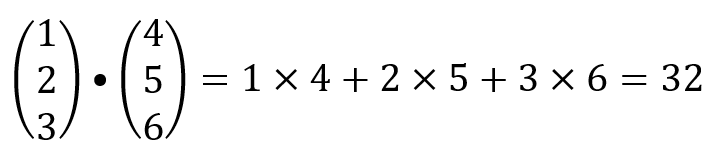
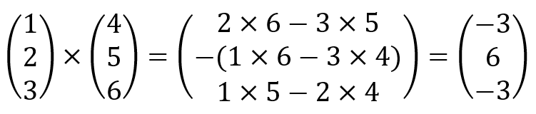

# LT7 Coursemology Complete Questions

- **Assessment:** LT 7 - Lists
- **Source URL:** https://yijc.coursemology.org/courses/3257/assessments/88730
- **Extraction date:** 2026-09-01 (Asia/Singapore)

## Learning outcomes

- **LO 2.2, Programming Elements and Constructs:** Use programming language elements and constructs to write recursive and non-recursive programs to solve a variety of problems.
- **2.2.1:** Understand the different types: integer, real, char, string and Boolean, and initialise one-dimensional and two-dimensional arrays.
- Know that lists are mutable.
- Know how to construct a list, add elements to it and remove elements from it.
- Know how to use indexing on lists.
- Know how to iterate through the elements in a list.

---

## Question 1: Which of the following are possible ways to create an empty list?

_Select all that apply._

- [ ] `()`
- [ ] `[]`
- [ ] `list()`
- [ ] `[" "]`
- [ ] `list[]`
- [ ] `list('')`
- [ ] `list(( ))`
- [ ] `list((" ", ))`
- [ ] `list.emptylist()`

## Question 2: Which of the following is a list?

_Select all that apply._

- [ ] `(2, 4)`
- [ ] `[2]`
- [ ] `[2,]`
- [ ] `[2, 4]`
- [ ] `list(2)`
- [ ] `list(2,4)`
- [ ] `list[2, 4]`
- [ ] `list("2,4")`
- [ ] `list( (2, 4) )`
- [ ] `list(" ")`
- [ ] `list('LIST')`

## Question 3: Which of the following will evaluate to `True`?

Given:

```python
lst = [1, 2, 4, 3, 8, 5, 7, 6, 4]
```

_Select all that apply._

- [ ] `max(lst) == 8`
- [ ] `min(lst) == 0`
- [ ] `[1] in lst`
- [ ] `lst[4] == 8`
- [ ] `5 in lst`
- [ ] `'8' in lst`
- [ ] `[2, 4] not in lst`
- [ ] `len(lst) == 8`
- [ ] `lst.count(4) == 2`

## Question 4: How many elements are there in the list?

```python
x = [1, [2, 3], [4], (5, 6), (7,), (), (8, (9, 10)), 11, 12]
```

- [ ] 11
- [ ] 3
- [ ] 9
- [ ] 7
- [ ] 8

## Question 5: What will the following statement evaluate to?

```python
[1, [2, 1], 1, [3, [1, 3]], [4, [1], 5], [1], 1, [[1]]].count(1)
```

- [ ] 2
- [ ] 3
- [ ] 7
- [ ] 8
- [ ] None of the above

## Question 6: List operations

Consider the following:

```python
>>> a = [1, 2, 3, 1, 2, 3]
>>> a.append(4)
>>> a.remove(3)
```

What is the output for `print(a)`?

- [ ] `[1, 2, 1, 2, 4]`
- [ ] `[1, 2, 3, 2, 3, 4]`
- [ ] `[1, 2, 1, 2, 3, 4]`
- [ ] `[4, 1, 2, 1, 2, 3]`

## Question 7: Equivalent and Identical

The following three assignment commands have been executed from first to last, from top to bottom:

```python
q = [123, 456]
s = q
q[0] = ()
```

Which of the following evaluate to `True`? Select all that apply.

- [ ] `q is s`
- [ ] `q == s`
- [ ] `q is [123, 456]`
- [ ] `q == [123, 456]`
- [ ] `q is [(), 456]`
- [ ] `q == [(), 456]`
- [ ] `s is [(), 456]`
- [ ] `s == [(), 456]`

## Question 8: Equivalent and Identical

The following two assignment commands have been executed from first to last, from top to bottom:

```python
p = ["hello", "kitty"]
r = p.copy()
```

Which of the following evaluate to `True`? Select all that apply.

- [ ] `r is p`
- [ ] `p == r`
- [ ] `p is ["hello", "kitty"]`
- [ ] `p == ["hello", "kitty"]`
- [ ] `r is ["hello", "kitty"]`
- [ ] `r == ["hello", "kitty"]`

## Question 9: Count string

Write a function, `count_strings(lst)`, that counts and returns the number of string-type elements in the list `lst`.

Example:

```python
>>> count_strings([0, '1', 'two', 3, (4, 5)])
2
```

### Code template

```python
def count_strings(lst):
    pass
```

### Public test cases

| Expression | Expected |
|---|---:|
| `count_strings([0, '1', 'two', 3, (4, 5)])` | `2` |
| `count_strings(['hello', True])` | `1` |

## Question 10: Double up

Write a function `double_up(lst)` that doubles the value of the elements in the list `lst`.

Example:

```python
>>> s = [1, 2, 3]
>>> double_up(s)
[2, 4, 6]
```

You may assume that all elements in the list are integers.

The list `lst` should be mutated. You should not create a new list in your function.

### Code template

```python
def double_up(lst):
    pass
```

### Public test cases

| Expression | Expected |
|---|---:|
| `double_up([1, 2, 3])` | `[2, 4, 6]` |
| `double_up([-1, 0, 1])` | `[-2, 0, 2]` |
| `double_up([])` | `[]` |

## Question 11

Write a function `remove_extras(lst)` that takes in a list and returns a **new list** with all repeated occurrences of any element removed. For example, `remove_extras([5, 2, 1, 2, 3])` will return a new list `[5, 2, 1, 3]`.

### Code template

```python
def remove_extras(lst):
    pass
```

### Public test cases

| Expression | Expected |
|---|---:|
| `remove_extras([1, 5, 1, 1, 3, 2])` | `[1, 5, 3, 2]` |
| `remove_extras([1, 1, 1, 2, 3])` | `[1, 2, 3]` |
| `remove_extras([1, 2, 3])` | `[1, 2, 3]` |
| `remove_extras([1, 1, 1, 2, 2, 3])` | `[1, 2, 3]` |

## Question 12

Reimplement `remove_extra(lst)` such that it takes in a list and returns the **same list** with all repeated occurrences removed. The order of the elements in the returned list does not matter.

### Code template

```python
def remove_extra(lst):
    pass

## For testing purposes. DO NOT REMOVE ##
lst1 = [1, 5, 1, 1, 3]
lst2 = [2, 2, 2, 1, 5, 4, 4]
```

### Public test cases

| Expression | Expected |
|---|---:|
| `lst1 == remove_extra(lst1)` | `True` |
| `lst1 is remove_extra(lst1)` | `True` |
| `remove_extra(lst2)` | `[2, 1, 5, 4]` |
| `remove_extra([])` | `[]` |

## Question 13

A 3-D vector can be represented by a list.

`m = [1, 2, 3]` and `n = [4, 5, 6]`.

The scalar product, or dot product, can be computed as follows:



Write a function `dot_product(vector1, vector2)` to return the scalar value when `vector1` dot `vector2`.

### Code template

```python
def dot_product(vector1, vector2):
    pass

# Do not modify:
m = [1, 2, 3]
n = [4, 5, 6]
```

### Public test cases

| Expression | Expected |
|---|---:|
| `dot_product(m, n)` | `32` |

## Question 14

A 3-D vector can be represented by a list.

`m = [1, 2, 3]` and `n = [4, 5, 6]`.

The vector product, or cross product, can be computed as follows:



Write a function `cross_product(vector1, vector2)` to return a list representing the resulting vector of `vector1 × vector2`.

### Code template

```python
def cross_product(vector1, vector2):
    pass

# Do not modify:
m = [1, 2, 3]
n = [4, 5, 6]
```

### Public test cases

| Expression | Expected |
|---|---:|
| `cross_product(m, n)` | `[-3, 6, -3]` |
