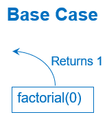
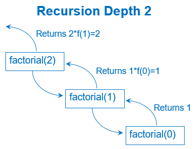
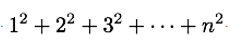

# LT9a Coursemology Complete Questions

- **Assessment:** LT 9a - Recursion
- **Source URL:** https://yijc.coursemology.org/courses/3257/assessments/88715
- **Extraction date:** 2026-09-01 (Asia/Singapore)

## Learning outcomes

- **LO 1.4 Recursion**
  - **1.4.1:** Know essential features of recursion.
  - **1.4.2:** Read and write simple recursive algorithms and programs.
  - **1.4.3:** Compare recursion with iteration.
- **LO 1.5 Data Validation and Program Testing**
  - **1.5.5:** Trace the steps and list the results of recursive programs, using recursion stack diagrams, and non-recursive programs.
- Explain what recursion is.
- Examine code to identify recursion and its components.
- Trace the steps and values of a recursive call.
- Visualise how pending operations build up and clear.
- Understand a problem involving recursion and write code to solve it.

---

## Question 1: Concept of recursion

Which of the following describe recursion in computer science? Select all that apply.

- [ ] 1. A method where the solution to a problem depends on solutions to smaller instances of the same problem.
- [ ] 2. A function defined in terms of itself.
- [ ] 3. A trivial solution exists for the smallest sub-problems.
- [ ] 4. A repetition of the same computational steps on the same data.
- [ ] 5. The sub-problems must be combined or assembled correctly to solve the main problem.
- [ ] 6. A method where we use wishful thinking.
- [ ] 7. A method where we use loops.

## Question 2: Identifying the Recursion Components

Refer to the recursive function `count(n)` below, where there are seven numbered lines of code:

```python
def count(n):                    # Line 1
    if n == 0:                   # Line 2
        print("Lift off!")       # Line 3
        return [0]               # Line 4
    else:                        # Line 5
        print(n)                 # Line 6
        return [n] + count(n-1)  # Line 7

count(5)  # Execute the function with input argument 5
```

Inspect the code. You can execute it as well to try to understand what it is doing.

Identify two features:

1. The line(s) of code in the function that checks for the base-case condition.
2. The line of code in the function that calls itself.

Copy and paste this template into your answer textbox, replacing each underscore with the correct line number:

```text
Base case condition: Line _
Recursive call: Line _
```

## Question 3

This question is a code-tracing practice. Trace the code manually using pen and paper before verifying the answer using Jupyter Notebook. You can add print statements to better understand how the recursion is being done.

```python
def foo(n):
    if n == 0:
        return 0
    else:
        return 2 * n + foo(n - 1)
```

What is the value of `foo(5)`?

- [ ] 30
- [ ] 29
- [ ] 28
- [ ] 20

## Question 4

Examine the following code for factorial, which takes in a positive integer `n`:

```python
def factorial(n):
    if n == 0:
        return 1
    else:
        return n + factorial(n)

factorial(5)
```

The code does not give the desired output when executed. Why is that so? There can be more than one reason.

- [ ] 1. The base case (`n == 0`) is incorrect.
- [ ] 2. The recursive call does not reduce to a simpler case.
- [ ] 3. The `math` module should be imported to use the factorial function.
- [ ] 4. There is a computational error in the code.

## Question 5: Recursion Trace Tree Diagram

A trace tree diagram is a way to visually track how a recursive function works, step by step.

This is the trace tree diagram for the factorial function's base case, 0. It simply returns the trivial solution:



This shows the trace tree diagram for the recursive call `factorial(2)`. `factorial(2)` calls `factorial(1)`, and `factorial(1)` calls `factorial(0)`, as shown by the downward arrows.

For the return path, `factorial(0)` returns the value 1, which is used by `factorial(1)` to return `1 × f(0) = 1`. `factorial(2)` uses that value to compute `2 × f(1)` and return 2.



Use the examples above to complete the trace tree diagram for the recursive function call `factorial(4)`.

## Question 6

This question is a code-tracing practice. Trace the code manually before verifying the answer using Jupyter Notebook.

```python
def bar(n):
    if n < 3:
        return n + 1
    else:
        return bar(n - 3) + bar(n - 2) + bar(n - 1)
```

What is the value of `bar(4)`?

- [ ] 10
- [ ] 11
- [ ] 9
- [ ] 16

## Question 7

This question is a code-tracing practice. Trace the code manually before verifying the answer using Jupyter Notebook.

Yeti wants to climb a 40-cubit gravel knoll. Unfortunately, the gravel is loose and Yeti's footing slips occasionally.

```python
def hike(current_altitude):
    if current_altitude > 40:
        return 0
    else:
        return 1 + slide(current_altitude + 11)

def slide(current_altitude):
    if current_altitude > 40:
        return 0
    else:
        return hike(current_altitude - 3)

n = hike(0)  # hike starting from altitude 0
```

Yeti takes `n` steps to climb from the bottom of the hill to the top. What is `n`?

- [ ] 4
- [ ] 5
- [ ] 6
- [ ] 7

## Question 8

Use recursion to write a program `count_sum` that returns the sum of all integer numbers from 1 to `n`.

The base case is the simplest case with the smallest problem size, where `n = 1`.

The general case `n` is related to the solution one size smaller, which is `n - 1`. To understand the connection, consider neighbouring problems of sizes 5 and 4:

```text
count_sum(5) = 5 + 4 + 3 + 2 + 1
count_sum(4) = 4 + 3 + 2 + 1
```

How can `count_sum(5)` use `count_sum(4)` to obtain an answer? Can you visualise how `count_sum(n)` uses `count_sum(n-1)` to obtain its answer?

### Code template

```python
def count_sum(n):
    pass
```

### Public test cases

| Expression | Expected |
|---|---:|
| `count_sum(1)` | `1` |
| `count_sum(2)` | `3` |
| `count_sum(5)` | `15` |
| `count_sum(10)` | `55` |

## Question 9: Sum of first n squares, recursive!

Complete the recursive function `sum_n_squares(n)` so that it computes the sum of the first `n` square numbers:



You may assume that `n` is always a positive integer, `n >= 1`.

The base case is the simplest case of the smallest problem, where `n = ____`.

The general case `n` is related to the solution one size smaller, `n - 1`. For example:

```text
sum_n_squares(5) = 1² + 2² + 3² + 4² + 5²
sum_n_squares(4) = 1² + 2² + 3² + 4²
```

How is `sum_n_squares(5)` computed from `sum_n_squares(4)`?

### Code template

```python
def sum_n_squares(n):
    pass
```

### Public test cases

| Expression | Expected |
|---|---:|
| `sum_n_squares(1)` | `1` |
| `sum_n_squares(4)` | `30` |
| `sum_n_squares(5)` | `55` |

## Question 10

Write a recursive program `count_odd(n)` that returns the sum of all odd numbers from 1 to `n`.

### Code template

```python
def count_odd(n):
    pass
```

### Public test cases

| Expression | Expected |
|---|---:|
| `count_odd(1)` | `1` |
| `count_odd(2)` | `1` |
| `count_odd(3)` | `4` |
| `count_odd(4)` | `4` |
| `count_odd(5)` | `9` |
| `count_odd(9)` | `25` |

## Question 11

Write a recursive program `count_even(n)` that returns the sum of all even numbers from 1 to `n`.

### Code template

```python
def count_even(n):
    pass
```

### Public test cases

| Expression | Expected |
|---|---:|
| `count_even(1)` | `0` |
| `count_even(2)` | `2` |
| `count_even(3)` | `2` |
| `count_even(4)` | `6` |
| `count_even(5)` | `6` |
| `count_even(6)` | `12` |
| `count_even(10)` | `30` |

## Question 12

Write non-recursive program code for the function `count_sum(n)` that sums all the numbers from 1 to `n`.

Your function should call `count_odd(n)` and `count_even(n)`, previously done in Q9 and Q10.

You do not need to define `count_odd(n)` and `count_even(n)`, as they have been defined for you.

### Code template

```python
# The functions count_odd and count_even have been defined for you.
# You do not need to define them again.

def count_sum(n):
    pass
```

### Public test cases

| Expression | Expected |
|---|---:|
| `count_sum(1)` | `1` |
| `count_sum(2)` | `3` |
| `count_sum(5)` | `15` |
| `count_sum(10)` | `55` |
