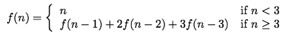
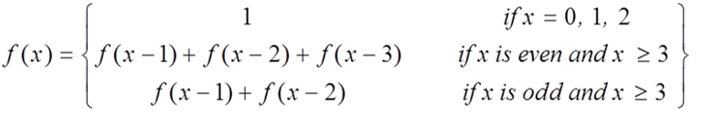
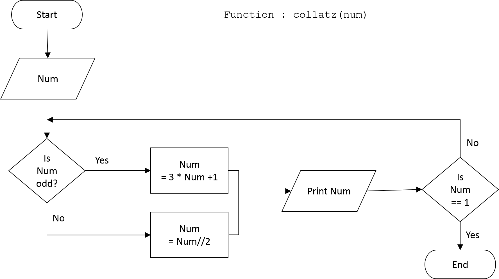
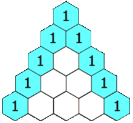

# LT9b Coursemology Complete Questions

- **Assessment:** LT 9b - Recursion (Application)
- **Source URL:** https://yijc.coursemology.org/courses/3257/assessments/88733
- **Extraction date:** 2026-09-01 (Asia/Singapore)

## Learning outcomes

- **LO 1.4 Recursion**
  - **1.4.1:** Know essential features of recursion.
  - **1.4.2:** Read and write simple recursive algorithms and programs.
  - **1.4.3:** Compare recursion with iteration.
- **LO 1.5 Data Validation and Program Testing**
  - **1.5.5:** Trace the steps and list the results of recursive programs, using recursion stack diagrams, and non-recursive programs.
- Explain recursion, identify recursion and its components, trace recursive calls, visualise pending operations, and solve problems with recursive code.
- Break a larger problem into a problem one size smaller.
- Produce neighbouring examples of a problem and its one-size-smaller form, understand how they relate, and assemble the larger answer using the smaller answer.

---

## Question 1: Function to remove adjacent duplicate characters

Write a recursive function `remove_adj_dup(string)` to remove any character in a string if it is the same as an adjacent one.

Examples:

```python
remove_adj_dup('abbccdd')  # returns 'abcd'
remove_adj_dup('100002')   # returns '102'
```

### Code template

```python
def remove_adj_dup(string):
    pass
```

### Public test cases

| Expression | Expected |
|---|---|
| `remove_adj_dup('ABCCD')` | `'ABCD'` |
| `remove_adj_dup('ABbBcc')` | `'ABbBc'` |
| `remove_adj_dup('122333444455555666666')` | `'123456'` |
| `remove_adj_dup('pppi     ====     3....11111455559')` | `'pi = 3.1459'` |
| `remove_adj_dup('ccccccccccc')` | `'c'` |

## Question 2: Shift-Left

Write recursive program code for the function `shift_left(string, n)` that returns a new string by shifting the first character of the old string to the back.

```text
shift_left("12345", 0) => "12345"
shift_left("12345", 1) => "23451"
shift_left("12345", 2) => "34512"
shift_left("12345", 3) => "45123"
shift_left("12345", 4) => "51234"
shift_left("12345", 5) => "12345"
shift_left("12345", 6) => "23451"
shift_left("12345", 7) => "34512"
...
```

### Code template

```python
def shift_left(string, n):
    pass
```

### Public test cases

| Expression | Expected |
|---|---|
| `shift_left("12345", 1)` | `"23451"` |
| `shift_left("def", 1)` | `"efd"` |
| `shift_left("12345", 2)` | `"34512"` |
| `shift_left("hello", 3)` | `"lohel"` |

## Question 3: Shift-Right

Write recursive program code for the function `shift_right(string, n)` that returns a new string by shifting the last character of the old string to the front.

```text
shift_right("12345", 0) => "12345"
shift_right("12345", 1) => "51234"
shift_right("12345", 2) => "45123"
...
```

### Code template

```python
def shift_right(string, n):
    pass
```

### Public test cases

| Expression | Expected |
|---|---|
| `shift_right("12345", 3)` | `"34512"` |
| `shift_right("hello", 2)` | `lohel` |
| `recursion` | `True` |

## Question 4: Recursive function with Fibonacci numbers

Leonardo Pisano Fibonacci, from the 12th century, is credited for the sequence:

```text
0, 1, 1, 2, 3, 5, 8, 13, 21, …
```

Each number in the sequence, except the first two, is the sum of the previous two. Fibonacci numbers can therefore be expressed as:

```text
fib(n) = 0,                    if n = 0
       = 1,                    if n = 1
       = fib(n-1) + fib(n-2),  otherwise
```

With `fib(0)` and `fib(1)` defined as 0 and 1:

- `fib(2)` is `0 + 1 = 1`
- `fib(3)` is `1 + 1 = 2`
- `fib(4)` is `1 + 2 = 3`

Write a recursive function `fib(n)` that returns the Fibonacci number in the sequence.

### Code template

```python
def fib(n):
    pass
```

### Public test cases

| Expression | Expected |
|---|---:|
| `fib(0)` | `0` |
| `fib(1)` | `1` |
| `fib(8)` | `21` |

## Question 5: Recursive function

A function `f(n)` is defined by the following rule:



Write a function `f(n)` that computes `f` by a recursive process.

### Code template

```python
def f(n):
    pass
```

### Public test cases

| Expression | Expected |
|---|---:|
| `f(-1)` | `-1` |
| `f(4)` | `11` |
| `f(20)` | `10771211` |

## Question 6: Recursive Sum

Write a recursive function `recursive_sum(x)` to accept a non-negative integer `x` and calculate `f(x)` based on the following formula:



### Code template

```python
def recursive_sum(x):
    pass
```

### Public test cases

| Expression | Expected |
|---|---:|
| `recursive_sum(2)` | `1` |
| `recursive_sum(3)` | `2` |
| `recursive_sum(6)` | `12` |

## Question 7: The Collatz Conjecture - An unsolved mathematical problem

A Collatz sequence is generated using these rules. For a given number `n` in the sequence, the next number is:

- `n / 2` if `n` is even, or
- `3n + 1` if `n` is odd.

Write a function `collatz(n)` to return the Collatz sequence as a list of numbers. The sequence ends when the number `1` appears.

For example, the output for `collatz(3)` is:

```python
[3, 10, 5, 16, 8, 4, 2, 1]
```

**Note:** Instead of printing the numbers, collect them and return them as a list when the number `1` appears.



Reference supplied in the prompt: https://www.straitstimes.com/singapore/pm-lee-spending-some-vacation-time-on-the-collatz-conjecture-5-things-about-the-unsolved

### Code template

```python
def collatz(n):
    pass
```

### Public test cases

| Expression | Expected |
|---|---|
| `collatz(6)` | `[6, 3, 10, 5, 16, 8, 4, 2, 1]` |
| `collatz(3)` | `[3, 10, 5, 16, 8, 4, 2, 1]` |
| `collatz(1)` | `[1]` |

## Question 8: Pascal Triangle and nCr

When performing binomial expansions for the following expressions:

```text
(a+b)² = a² + 2a·b + b²
(a+b)³ = a³ + 3a²·b + 3a·b² + b³
(a+b)⁴ = a⁴ + 4a³·b + 6a²·b² + 4a·b³ + b⁴
```

The coefficients `[1,2,1]`, `[1,3,3,1]` and `[1,4,6,4,1]` can be found in Pascal's Triangle.



_Diagram taken from Wikipedia._

For simplicity, represent the function `choose(n, r)` as `nCr` when translating the diagram:

```text
                  0C0 = 1

             1C0 = 1, 1C1 = 1

        2C0 = 1, 2C1 = 2, 2C2 = 1

   3C0 = 1, 3C1 = 3, 3C2 = 3, 3C3 = 1

4C0 = 1, 4C1 = 4, 4C2 = 6, 4C3 = 4, 4C4 = 1
```

It can be observed that `nCr` can be computed by adding two values from the row directly above it. For example:

```text
4C0 = 1
4C1 = 3C0 + 3C1 = 1 + 3 = 4
4C2 = 3C1 + 3C2 = 3 + 3 = 6
4C3 = 3C2 + 3C3 = 3 + 1 = 4
4C4 = 1
```

Write recursive program code for the function `choose(n, r)` that takes in two positive integers `n` and `r` and returns the value of `nCr`.

**Hint:** It is important to understand the base case.

### Code template

```python
def choose(n, r):
    pass
```

### Public test cases

| Expression | Expected |
|---|---:|
| `choose(4, 2)` | `6` |
| `choose(5, 0)` | `1` |
| `choose(6, 6)` | `1` |
| `choose(7, 4)` | `35` |
| `choose(18, 8)` | `43758` |
