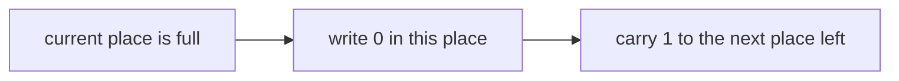
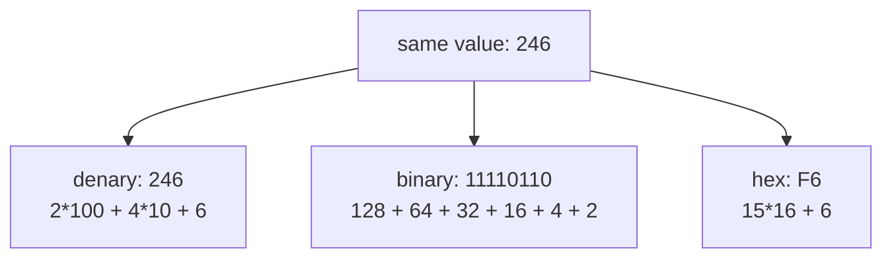
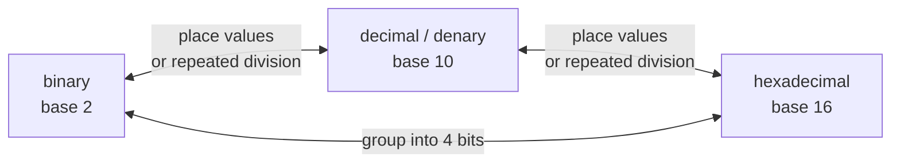
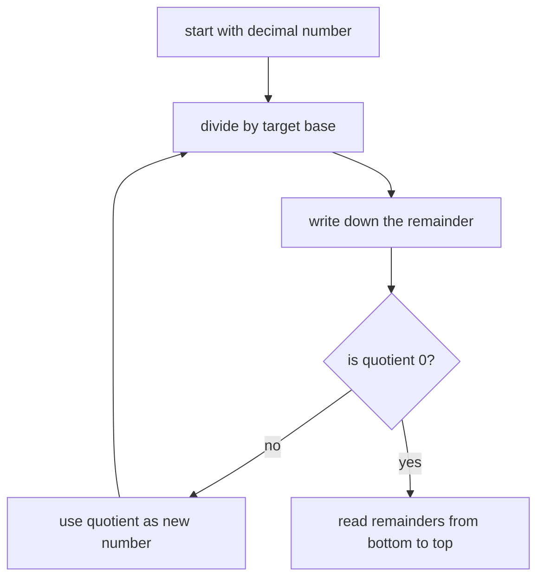
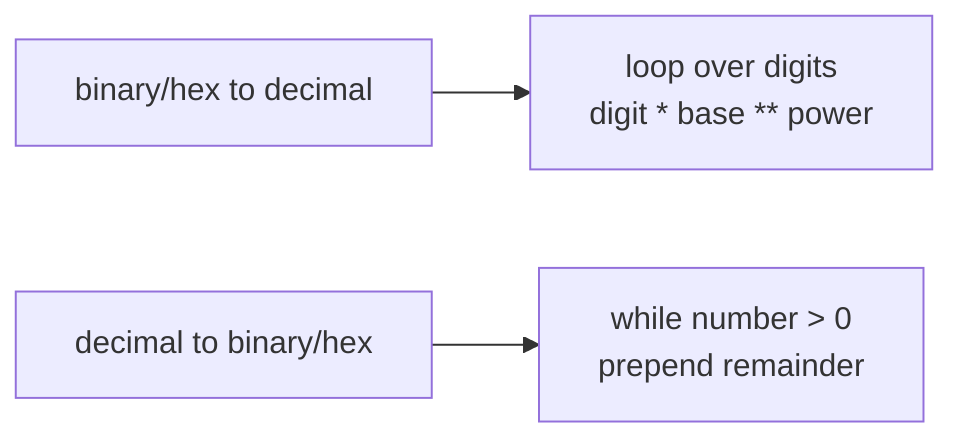
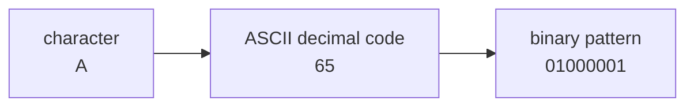
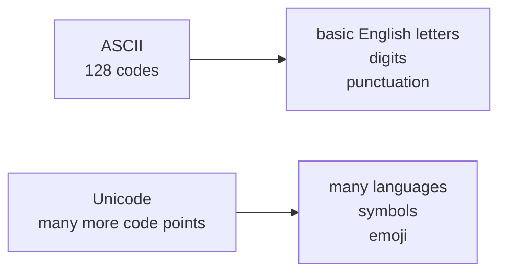

> [!summary] Quick View
> Data representation = how the same value can be written using bits, binary, denary, hexadecimal, and character codes.

## Bits and Values

- Bit: one binary digit, `0` or `1`
- Byte: 8 bits
- `n` bits can represent `2 ** n` different patterns

| Bits | Number of patterns |
| ---- | ------------------ |
| 4 | `16` |
| 8 | `256` |
| 16 | `65,536` |

> [!tip]
> More bits means more unique patterns. It does not automatically mean the values are signed unless the question says so.

Bit place value picture:

```text
8-bit pattern:  1    1    1    1    0    1    1    0
Place value:   128   64   32   16    8    4    2    1
Contribution:  128 + 64 + 32 + 16 + 0  + 4  + 2  + 0 = 246
```

<iframe class="note-widget-frame base-converter" src="./pictures/base-converter.html" title="Interactive base converter" style="width:100%;height:820px;border:1px solid #d8d3ca;border-radius:8px;background:#fff;"></iframe>

[Open standalone base converter](./pictures/base-converter.html)

## Number Bases

Base = how many different digit symbols a place can use before it carries to the next place.

| Base | Name | Digits | Example |
| ---- | ---- | ------ | ------- |
| 2 | binary | `0`, `1` | `1011` |
| 10 | decimal / denary | `0` to `9` | `255` |
| 16 | hexadecimal | `0` to `9`, `A` to `F` | `FF` |

## Base Cheat Table

Every number base follows the same place-value rule. The rightmost place is worth `1`, then each step left multiplies by the base.

| Base | Name | Digits allowed | Place values from right to left | Example meaning |
| ---- | ---- | -------------- | ------------------------------- | --------------- |
| `2` | binary | `0`, `1` | `1`, `2`, `4`, `8`, `16`, ... | `1011` = `1*8 + 0*4 + 1*2 + 1*1` = `11` |
| `3` | ternary | `0`, `1`, `2` | `1`, `3`, `9`, `27`, ... | `102` = `1*9 + 0*3 + 2*1` = `11` |
| `8` | octal | `0` to `7` | `1`, `8`, `64`, `512`, ... | `13` = `1*8 + 3*1` = `11` |
| `10` | denary / decimal | `0` to `9` | `1`, `10`, `100`, `1000`, ... | `246` = `2*100 + 4*10 + 6*1` |
| `16` | hexadecimal | `0` to `9`, `A` to `F` | `1`, `16`, `256`, `4096`, ... | `F6` = `15*16 + 6*1` = `246` |
| `n` | base `n` | `0` to `n-1` | `1`, `n`, `n^2`, `n^3`, ... | digits are multiplied by powers of `n` |

> [!important]
> 2027 H2 Computing focuses on binary, denary/decimal, and hexadecimal. Other bases just help show the pattern.

## Carry Rule

Carry means: when a column runs out of allowed digits, reset that column to `0` and add `1` to the column on the left.



| Base | Digits allowed in one place | Biggest single digit | Next value after that | What written `10` means |
| ---- | --------------------------- | -------------------- | --------------------- | ----------------------- |
| base 2 | `0`, `1` | `1` | `10` | one `2` and zero `1`s |
| base 10 | `0` to `9` | `9` | `10` | one `10` and zero `1`s |
| base 16 | `0` to `F` | `F` | `10` | one `16` and zero `1`s |

So `10` does not always mean ten. It means **one group of the base and zero ones**.

Counting shows the carry:

```text
base 10:  0, 1, 2, 3, 4, 5, 6, 7, 8, 9, 10, 11, ...
base 2:   0, 1, 10, 11, 100, 101, 110, 111, 1000, ...
base 16:  0, 1, 2, 3, ..., 8, 9, A, B, C, D, E, F, 10, 11, ...
```

Addition examples:

```text
base 10:
  9 + 1 = 10
  because after 9, the ones place resets to 0 and carries 1 ten.
```

```text
base 2:
  1 + 1 = 10
  because after 1, the ones place resets to 0 and carries 1 two.

  10 base 2 = 2 base 10
```

```text
base 16:
  F + 1 = 10
  because after F, the ones place resets to 0 and carries 1 sixteen.

  10 base 16 = 16 base 10
```

Carry can chain through several full places:

```text
binary:
  111 + 1 = 1000
  7   + 1 = 8

hexadecimal:
  FF  + 1 = 100
  255 + 1 = 256
```

## Decimal vs Everything Else

In this topic, decimal usually means **base 10**. Denary also means **base 10**.

| Word | Meaning here | Example | What the places mean |
| ---- | ------------ | ------- | -------------------- |
| decimal / denary | base 10 number | `246` | `2 hundreds + 4 tens + 6 ones` |
| binary | base 2 number | `11110110` | `128 + 64 + 32 + 16 + 4 + 2` |
| hexadecimal | base 16 number | `F6` | `15 sixteens + 6 ones` |

These can all mean the same value:

| Same value | Written as | Why |
| ---------- | ---------- | --- |
| decimal / denary | `246` | `2*100 + 4*10 + 6*1` |
| binary | `11110110` | `1*128 + 1*64 + 1*32 + 1*16 + 0*8 + 1*4 + 1*2 + 0*1` |
| hexadecimal | `F6` | `15*16 + 6*1` |

The difference is not the value. The difference is the **number system used to write it**.

```text
246 base 10 = 11110110 base 2 = F6 base 16
```

> [!warning]
> A "decimal number" can also mean a number with a decimal point, like `3.14`.
> For C2 conversions, decimal/denary usually means base 10 positive integers, like `246`, unless the question says otherwise.

## Binary From Scratch

Binary is **base 2**. That means each place can only hold two digits:

- `0` means this place value is not used
- `1` means this place value is used

Binary place values double as you move left.

```text
Binary places:  ...   128    64    32    16     8     4     2     1
```

Think of binary as switches:

```text
binary:          1      1     0     1
place value:     8      4     2     1
switch meaning:  on     on    off   on

value = 8 + 4 + 0 + 1 = 13
```

So:

```text
1101 base 2 = 13 base 10
```

Counting in binary:

| Denary | Binary | 4-bit binary |
| ------ | ------ | ------------ |
| `0` | `0` | `0000` |
| `1` | `1` | `0001` |
| `2` | `10` | `0010` |
| `3` | `11` | `0011` |
| `4` | `100` | `0100` |
| `5` | `101` | `0101` |
| `6` | `110` | `0110` |
| `7` | `111` | `0111` |
| `8` | `1000` | `1000` |
| `9` | `1001` | `1001` |
| `10` | `1010` | `1010` |
| `11` | `1011` | `1011` |
| `12` | `1100` | `1100` |
| `13` | `1101` | `1101` |
| `14` | `1110` | `1110` |
| `15` | `1111` | `1111` |

Why `10` in binary means two:

```text
10 base 2
= 1*2^1 + 0*2^0
= 1*2 + 0*1
= 2
```

How to write a denary number in binary:

1. Find the biggest power of 2 that fits.
2. Put `1` under it.
3. Subtract it.
4. Move right through the smaller powers of 2.
5. Put `1` if you need that value, otherwise put `0`.

Example: write denary `13` in binary.

```text
Place values:  8   4   2   1
Need 13:       yes yes no  yes
Bits:          1   1   0   1

13 base 10 = 1101 base 2
```

> [!tip]
> Binary is not a different value. It is a different way to write the same value using only `0` and `1`.

Hex digit values:

| Hex | Decimal |
| --- | ------- |
| `A` | `10` |
| `B` | `11` |
| `C` | `12` |
| `D` | `13` |
| `E` | `14` |
| `F` | `15` |

## Representing the Same Value

Denary, binary, and hexadecimal can represent the same number. Only the base and place values change.

```text
Same value:

denary       246
binary       11110110
hexadecimal  F6
```

Base means "what each place is worth as you move left".

```text
Denary / base 10:

digits:       2       4       6
places:     10^2    10^1    10^0
values:      100      10       1
meaning:   2*100 + 4*10 + 6*1 = 246
```

```text
Binary / base 2:

digits:       1     1     1     1     0     1     1     0
places:     2^7   2^6   2^5   2^4   2^3   2^2   2^1   2^0
values:     128    64    32    16     8     4     2     1
meaning:    128 + 64 + 32 + 16 + 0 + 4 + 2 + 0 = 246
```

```text
Hexadecimal / base 16:

digits:       F       6
places:     16^1    16^0
values:      16       1
meaning:   15*16 + 6*1 = 246
```

The pattern is always the same:

```text
moving left multiplies the place value by the base

base 10:  ... 1000   100    10    1
base 2:   ...    8     4     2    1
base 16:  ... 4096   256    16    1
```



Conversion direction map:



## Base to Decimal

Multiply each digit by its place value.

Think of each digit sitting above a place value:

```text
Binary number:     1      0      1      1
Place value:      2^3    2^2    2^1    2^0
Decimal value:     8      4      2      1
Contribution:      8      0      2      1

Total = 8 + 0 + 2 + 1 = 11
```

```text
1011 base 2
= 1*2^3 + 0*2^2 + 1*2^1 + 1*2^0
= 8 + 0 + 2 + 1
= 11
```

```text
2F base 16
= 2*16^1 + 15*16^0
= 32 + 15
= 47
```

## Decimal to Another Base

Repeated division method:

1. Divide by the target base.
2. Record the remainder.
3. Continue with the quotient.
4. Read remainders from bottom to top.

Process picture:



Example: convert decimal `246` to binary.

| Division | Quotient | Remainder |
| -------- | -------- | --------- |
| `246 / 2` | `123` | `0` |
| `123 / 2` | `61` | `1` |
| `61 / 2` | `30` | `1` |
| `30 / 2` | `15` | `0` |
| `15 / 2` | `7` | `1` |
| `7 / 2` | `3` | `1` |
| `3 / 2` | `1` | `1` |
| `1 / 2` | `0` | `1` |

The confusing part is the reading direction:

```text
Remainders collected: 0  1  1  0  1  1  1  1
                       |  |  |  |  |  |  |  |
Answer reads:         1  1  1  1  0  1  1  0
```

```text
246 base 10 = 11110110 base 2
```

Example: convert decimal `51966` to hexadecimal.

| Division | Quotient | Remainder | Hex digit |
| -------- | -------- | --------- | --------- |
| `51966 / 16` | `3247` | `14` | `E` |
| `3247 / 16` | `202` | `15` | `F` |
| `202 / 16` | `12` | `10` | `A` |
| `12 / 16` | `0` | `12` | `C` |

```text
51966 base 10 = CAFE base 16
```

Same idea visually:

```text
Remainders:  E   F   A   C
             |   |   |   |
Read this:   C   A   F   E
```

## Binary and Hex Shortcut

One hex digit is exactly 4 bits.

| Binary | Hex |
| ------ | --- |
| `0000` | `0` |
| `0001` | `1` |
| `1010` | `A` |
| `1111` | `F` |

Binary to hex:

```text
11110110
= 1111 0110
= F6
```

Visual:

```text
Binary:  1111   0110
          |      |
Hex:      F      6
```

Hex to binary:

```text
2F
= 0010 1111
```

Visual:

```text
Hex:      2      F
          |      |
Binary:  0010   1111
```

Drop leading zeros only when they are not needed for a fixed-width representation.

## Uses

Binary is used because digital circuits naturally represent two stable states:

- off/on
- low/high voltage
- false/true

Hexadecimal is used because it is a shorter way to write binary:

- memory addresses
- machine code
- colour codes, for example `#FF0000`
- byte values, for example `0x7F`

Why hex is shorter:

```text
Binary byte:  1111 0110
Hex byte:       F    6

8 binary digits become 2 hex digits.
```

## Coding Base Conversions

For manual conversion questions, avoid `bin()`, `hex()`, and `int(value, base)` unless the question explicitly allows them.

Code pattern map:



Binary to decimal:

```python
def binary_to_decimal(bits):
    total = 0

    for i in range(len(bits)):
        power = len(bits) - 1 - i
        total += int(bits[i]) * 2 ** power

    return total
```

Decimal to binary:

```python
def decimal_to_binary(num):
    if num == 0:
        return "0"

    bits = ""

    while num > 0:
        bits = str(num % 2) + bits
        num = num // 2

    return bits
```

Hexadecimal to decimal:

```python
def hex_to_decimal(hex_string):
    digits = "0123456789ABCDEF"
    total = 0

    hex_string = hex_string.upper()

    for i in range(len(hex_string)):
        power = len(hex_string) - 1 - i
        total += digits.index(hex_string[i]) * 16 ** power

    return total
```

Decimal to hexadecimal:

```python
def decimal_to_hex(num):
    digits = "0123456789ABCDEF"

    if num == 0:
        return "0"

    result = ""

    while num > 0:
        result = digits[num % 16] + result
        num = num // 16

    return result
```

Quick checks:

```python
print(binary_to_decimal("11110110"))  # 246
print(decimal_to_binary(246))         # 11110110
print(hex_to_decimal("CAFE"))         # 51966
print(decimal_to_hex(51966))          # CAFE
```

## ASCII

ASCII maps characters to integer codes.

- ASCII is a 7-bit character set.
- `2 ** 7 = 128` possible codes.
- It is enough for basic English letters, digits, punctuation, and control codes.
- It is not enough for characters from many other languages.

Character to code picture:



Common examples:

| Character | Decimal code | Hex |
| --------- | ------------ | --- |
| `"A"` | `65` | `41` |
| `"a"` | `97` | `61` |
| `"0"` | `48` | `30` |
| `"4"` | `52` | `34` |
| `"$"` | `36` | `24` |

Python:

```python
ord("A")  # 65
chr(65)   # "A"
```

Useful pattern:

```python
digit = "7"
value = ord(digit) - ord("0")
print(value)  # 7
```

## Unicode

Unicode gives code points to characters from many languages and symbol sets.

Why Unicode is needed:

- ASCII only has 128 codes.
- Different languages need far more characters.
- A shared standard avoids different systems using different numbers for the same character.

ASCII vs Unicode picture:



Examples:

| Language | Unicode escape | Character / word |
| -------- | -------------- | ---------------- |
| Arabic | `\u062d\u0628` | حب |
| Chinese | `\u7231` | 爱 |
| Greek | `\u03b1\u03b3\u03ac\u03c0\u03b7` | αγάπη |
| Korean | `\uc0ac\ub791` | 사랑 |
| Russian | `\u043b\u044e\u0431\u043b\u044e` | люблю |

Python strings support Unicode:

```python
print("\uc0ac\ub791")  # 사랑
```

## Common Mistakes

- Reading division remainders from top to bottom instead of bottom to top.
- Forgetting that hex `A` to `F` represent decimal `10` to `15`.
- Dropping leading zeros when the question asks for a fixed number of bits.
- Using `int(value, base)` in a question that asks you to implement the conversion manually.
- Confusing ASCII with Unicode. ASCII is small; Unicode covers many languages.

## Exam Checklist

- Can convert binary to decimal using place values.
- Can convert hexadecimal to decimal using place values.
- Can convert decimal to binary using repeated division.
- Can convert decimal to hexadecimal using repeated division.
- Can group binary into 4-bit chunks for hex conversion.
- Can explain why binary is used by computers.
- Can explain why hexadecimal is used as a compact form of binary.
- Can use `ord()` and `chr()` for ASCII character codes.
- Can explain why Unicode is needed and give examples from different languages.

## Optional Context

UTF-8 is a common way to store or transmit Unicode as bytes. It is useful background, but the 2027 H2 Computing data representation outcome names Unicode examples, not UTF-8 byte decoding.

## Related

- [[basic python]]
