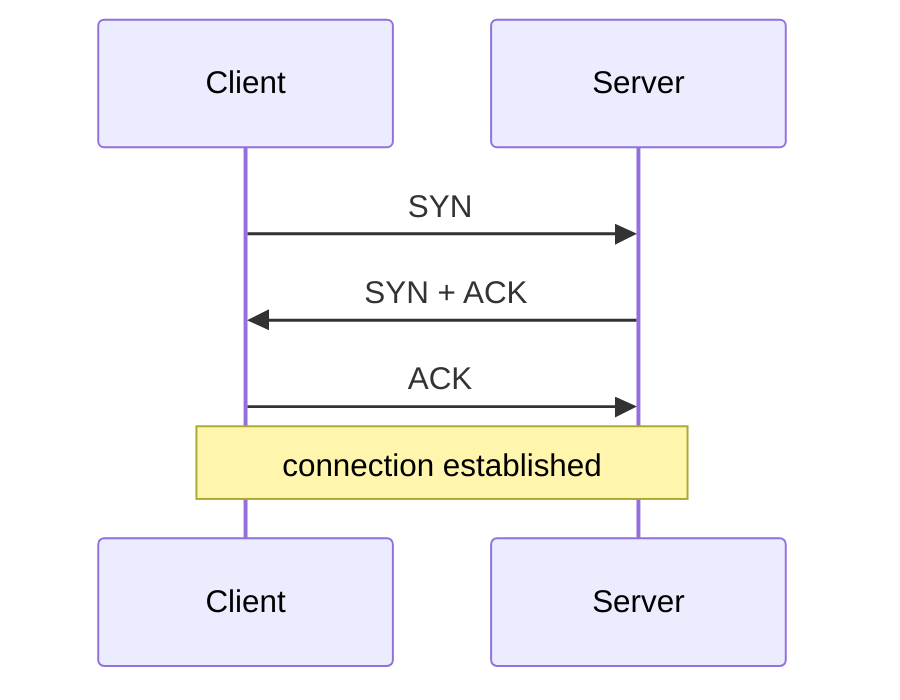

> [!summary] Quick View
> A network connects devices so data can move between them. IP gets data to the right **network**; MAC gets it to the right **device**.

> [!important] What C3 / syllabus section 4.1 examines
> C3 covers the five **computer-network fundamentals** outcomes below. Module 4 also contains section 4.2 Web Applications, which is taught separately later in the course.
>
> | Outcome | Where |
> | ------- | ----- |
> | 4.1.1 LAN, WAN, intranet, structure of the internet | Network Types, Internet ≠ Web |
> | 4.1.2 IP addressing and DNS | Addressing, DNS |
> | 4.1.3 need for communication protocols | Why Protocols Are Needed |
> | 4.1.4 how data is transmitted in a packet-switching network | Packet Switching |
> | 4.1.5 client–server architecture | Client–Server vs Peer-to-Peer |
>
> Everything else here — topologies, the switch's SAT, DHCP, SMTP/POP3/IMAP, RAID — came from the C3a lecture and videos. It is useful practical context but is **not named** in the 2027 learning outcomes. Questions from 2020–2024 belong to the legacy syllabus, so use them for overlapping concepts rather than to predict 2027 frequency.

## Network Types

| Type | Scale |
| ---- | ----- |
| PAN | personal, a few metres |
| LAN | one room or building |
| WLAN | wireless LAN |
| CAN | campus — several nearby LANs |
| MAN | city scale |
| WAN | country or global; the internet is a WAN |
| SAN | storage area network |

> [!important] Internet ≠ Web
> | | Is |
> | --- | -- |
> | Internet | the infrastructure — cables, routers, connected machines |
> | Web | one service on it — pages and links, over HTTP |
>
> Email, DNS and file transfer also run on the internet but are not the web.

- Backbone: **fibre optic cable**, much of it undersea.
- Satellite links are useful where cables are impractical, but long propagation distances—especially for geostationary satellites—add **latency**.

**Intranet** — a private network that uses internet technologies (web pages, email) but is restricted to one organisation. Reachable from outside only through controlled access.

## Client–Server vs Peer-to-Peer

| | Client–server | Peer-to-peer |
| --- | ------------- | ------------ |
| Roles | server provides, clients request | every device does both |
| Data | centralised on the server | spread across devices |
| Backup / admin | done centrally | done on each device |
| Cost | needs dedicated server hardware | no dedicated hardware |
| Failure | server is a single point of failure | no single point of failure |
| Suits | large networks | small networks |

## Why Protocols Are Needed

A protocol is an agreed set of rules for communication. Without one:

- devices from different manufacturers, running different software, cannot interpret each other's data
- there is no agreement on message **format**, **order**, **speed** or **error checking**
- the receiver has no way to tell where one message ends and the next begins

## Hosts, Nodes and Media

| Term | Meaning |
| ---- | ------- |
| Host | an end device that sends or receives data, such as a client or server |
| Node | any device or connection point participating in the network, such as a host, switch or router |
| Medium | the physical or wireless path the signal travels |

Media: copper cable carries electrical signals, fibre optic carries light pulses, wireless carries electromagnetic waves.

## Addressing

| Address | Identifies | Scope |
| ------- | ---------- | ----- |
| MAC | the physical device | delivery **within** a LAN |
| IP | the device's network location | routing **between** networks |

- **MAC** — 48-bit, hexadecimal, e.g. `00-16-EA-06-6C-3E`, built into the NIC
- **IPv4** — 32-bit, four decimal numbers `0`–`255` separated by dots, e.g. `192.168.0.1`

So the **two ways a device can be identified on a LAN** are its MAC address and its IP address.

A host can be allocated an IP address in **two ways**:

- **Statically** — configured manually and stays the same until an administrator changes it
- **Dynamically** — assigned automatically from a pool by a **DHCP** server, on a lease

> [!important]
> IP gets the data to the correct **network**. MAC gets it to the correct **device** inside that network. ARP is what finds a device's MAC address from its IP address within a LAN.

> [!important] Along the route
> In ordinary routing **without NAT**, the destination IP address stays the same from source to final destination. The source and destination **MAC addresses change on every local link** because a frame only identifies the sender and next hop on that link.
>
>
> ```mermaid
> flowchart LR
>     PC([PC]) -->|"MAC: PC to A"| RA[router A]
>     RA -->|"MAC: A to B"| RB[router B]
>     RB -->|"MAC: B to server"| S([server])
> ```
>
> A new MAC pair is used on every link. The destination IP is identical on all three links only because this example has no address translation.

Analogy: an IP address is the end-to-end mailing address used for routing; a MAC address is the local delivery label for the next link. A network interface is normally assigned a hardware MAC address, although software can override it.

### Private vs Public IP

| | Private | Public |
| --- | ------- | ------ |
| Used | inside a LAN | on the internet |
| Routable on the internet | no | yes |
| Assigned by | the local router / DHCP | the ISP |
| Example | `192.168.0.3` | `192.166.122.7` |

The router swaps the private source address for its public one on the way out, and back again on the way in.

### Subnet Mask and Gateway

The subnet mask decides whether two IP addresses are on the same local network.

```text
IP:          192.168.0.10
Subnet mask: 255.255.255.0
Network:     192.168.0        < the part the mask keeps
```

If the destination is outside the local network, the device sends the packet to its **default gateway** — usually the router.

## Packet Switching

The internet uses packet switching.

- data is split into packets
- each packet travels independently and may take a different route
- the destination reassembles them in order using the sequence numbers

Do not mix up the layers:

| Unit | Important fields |
| ---- | ---------------- |
| IP packet | IP header with source/destination IP and protocol; payload carrying the transport data |
| TCP segment | port numbers, sequence/acknowledgement numbers and application data |
| Data-link frame | source/destination MAC, the packet as payload and usually an error-checking trailer such as an FCS/CRC |

Circuit switching instead reserves one fixed path for the whole communication. Packet switching is more resilient — if one route fails, packets take another.

**Why data is divided into packets** — small packets share the links fairly rather than one large transfer blocking them, and a corrupted packet only needs that packet resent, not the whole file.

**Why data units are sequentially numbered** — they can arrive out of order after taking different routes, so a reliable transport protocol such as TCP can **reassemble them correctly** and spot missing data.

**Disadvantage, and how it is handled** — packets may arrive out of order, be delayed, or be lost entirely. IP itself is best effort; when reliability is required, TCP uses sequence numbers, acknowledgements and retransmission.

**Role of a router** — it inspects each packet's destination **IP address** and forwards it along the best available route towards that network, hop by hop. Each packet is routed independently, so different packets from the same message may take different paths.

## TCP

Transmission Control Protocol — **connection-oriented** and **reliable**. A session has three stages: set up, transfer, close.

### Three-Way Handshake



| Step | Meaning |
| ---- | ------- |
| `SYN` | "can we talk?" |
| `SYN + ACK` | "yes — and can we talk?" |
| `ACK` | "yes" |

Closing takes **four** steps: `FIN`, `ACK`, `FIN`, `ACK` — each side must close its own direction.

During transfer TCP provides a reliable, ordered byte stream: it detects missing data and requests retransmission. If recovery becomes impossible, the connection fails rather than silently claiming successful delivery.

| State | Meaning |
| ----- | ------- |
| LISTEN | server waiting for a connection request |
| ESTABLISHED | handshake done, data flowing |
| CLOSED | no connection |

## Switches and Routers

| Device | Layer | Uses | Purpose |
| ------ | ----- | ---- | ------- |
| Hub | 1 | no addressing | broadcasts to every port |
| Switch | 2 | MAC addresses | connects devices **inside** one LAN |
| Router | 3 | IP addresses | connects **different** networks |

A switch builds a **Source Address Table (SAT)**:

1. starts empty
2. records the source MAC address and port of each incoming frame
3. broadcasts to all other ports when the destination is unknown
4. once a reply arrives, sends future traffic straight to the correct port

## Topologies

| Topology | Idea | Risk |
| -------- | ---- | ---- |
| Bus | all devices share one cable | a cable break collapses the network |
| Ring | devices form a closed loop | one failure can disrupt traffic |
| Star | all devices connect to a central switch | the switch is a single point of failure |
| Mesh | devices connect to many or all others | high cost and complexity |

Star is the most common in a LAN. For a fully meshed network:

```text
connections = n * (n - 1) / 2
```

## Servers

A server provides services to clients: web, DNS, DHCP, mail, file.

Enterprise servers are built for reliability — run 24/7, handle many concurrent connections, and may use ECC RAM, RAID storage, redundant power supplies and hot-swappable drives.

## DNS

Translates domain names into IP addresses, so nobody has to memorise numbers.

```text
www.yijc.edu.sg  ->  192.168.0.12
```

1. browser asks the resolver
2. resolver asks a root server
3. root points to the TLD server (`.com`, `.sg`)
4. TLD points to the authoritative name server
5. authoritative server returns the IP address

## DHCP

Dynamic Host Configuration Protocol — automatically gives a device its IP address, subnet mask, default gateway and DNS server.

Addresses are handed out on a **lease**. When the lease expires the address returns to the pool for reuse.

## Email Protocols

| Protocol | Purpose |
| -------- | ------- |
| SMTP | sends mail from client to server, and between mail servers |
| POP3 | downloads mail to one device, usually removing it from the server |
| IMAP | keeps mail on the server and syncs it across devices |

SMTP runs over TCP to help ensure delivery.

> [!example]- Filius hands-on settings
> Peer-to-peer:
>
> ```text
> Notebook 1: 192.168.0.10
> Notebook 2: 192.168.0.11
> Subnet:     255.255.255.0
> ```
>
> Two LANs joined by a router:
>
> ```text
> LAN1 network: 192.168.0      Router NIC1: 192.168.0.1
> LAN2 network: 192.168.1      Router NIC2: 192.168.1.1
> ```
>
> Devices in LAN1 use gateway `192.168.0.1`; devices in LAN2 use `192.168.1.1`.
>
> DNS server:
>
> ```text
> DNS server: 192.168.2.10     Domain:     www.yijc.edu.sg
> Router NIC: 192.168.2.1      Web server: 192.168.0.12
> ```
>
> Tests:
>
> ```text
> ping 192.168.0.11
> ipconfig
> http://192.168.0.12
> http://www.yijc.edu.sg
> ```

## Related

- [[C2 Data representation]]
- [[LT10d Hashing]]
