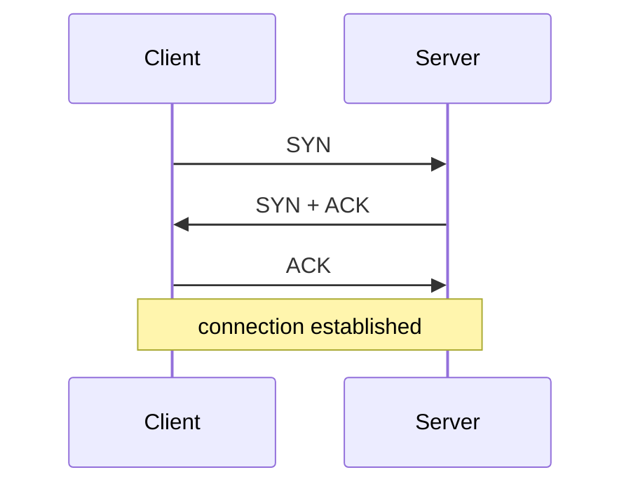
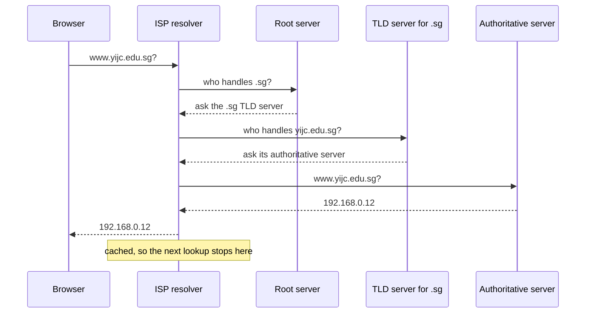

> [!summary] Quick View
> A network connects devices so data can move between them. IP gets data to the right **network**. MAC gets it to the right **device**.

> [!important] What 4.1 examines
> Five outcomes. (4.2 Web Applications is the other half of Module 4, taught later.)
>
> | Outcome | Where |
> | ------- | ----- |
> | 4.1.1 LAN, WAN, intranet, structure of the internet | Network Types, Internet ≠ Web |
> | 4.1.2 IP addressing and DNS | Addressing, DNS |
> | 4.1.3 need for communication protocols | Why Protocols Are Needed |
> | 4.1.4 how data is transmitted in a packet-switching network | Packet Switching |
> | 4.1.5 client–server architecture | Client–Server vs Peer-to-Peer |
>
> Everything else here (topologies, the switch's SAT, DHCP, SMTP/POP3/IMAP, RAID) came from the C3a lecture and videos. **Not named** in y27, but the 2026 Mock Promo still asked how the switch and router register a new device (switch learns its MAC, router assigns its IP by DHCP). The 2020–2024 papers are the old syllabus, so use them for the concepts, not to guess what's coming.

## Network Types

| Type | Scale |
| ---- | ----- |
| PAN | personal, a few metres (Bluetooth, NFC, USB) |
| LAN | one room or building |
| WLAN | wireless LAN |
| CAN | campus (several nearby LANs) |
| MAN | city scale |
| WAN | country or global (the internet is a WAN) |
| SAN | storage area network |

> [!important] Internet ≠ Web
> | | Is |
> | --- | -- |
> | Internet | the infrastructure: cables, routers, connected machines |
> | Web | one service on it: pages and links, over HTTP |
>
> Email, DNS and file transfer also run on the internet but are not the web.

- Backbone: **fibre optic cable**, much of it undersea. Light pulses cross the oceans, then get converted to electrical signals for local ISPs.
- **ICANN** manages the global IP addressing and domain name system.
- Satellite reaches where cables can't, but the round trip adds **latency**.

**Intranet**: an organisation's private network using internet technologies (web pages, email), with controlled external access.

## Client–Server vs Peer-to-Peer

| | Client–server | Peer-to-peer |
| --- | ------------- | ------------ |
| Roles | server provides, clients request | every device does both |
| Data | centralised on the server | spread across devices |
| Backup / admin | done centrally | done on each device |
| Cost | needs dedicated server hardware | no dedicated hardware |
| Failure | server is a single point of failure | no single point of failure |
| Suits | large networks | small networks |

## Why Protocols Are Needed

A protocol is an agreed set of rules for communication. Without one:

- devices from different manufacturers, running different software, cannot interpret each other's data
- there is no agreement on message **format**, **order**, **speed** or **error checking**
- receivers cannot identify message boundaries

## Hosts, Nodes and Media

| Term | Meaning |
| ---- | ------- |
| Host | a client or server on the network |
| Node | anything on the network: host, switch or router |
| Medium | the physical or wireless path the signal travels |

Media: copper cable carries electrical signals, fibre optic carries light pulses, wireless carries electromagnetic waves.

## Addressing

| Address | Identifies | Scope |
| ------- | ---------- | ----- |
| MAC | the physical device | delivery **within** a LAN |
| IP | the device's network location | routing **between** networks |

- **MAC**: 48-bit, hexadecimal, e.g. `00-16-EA-06-6C-3E`, built into the NIC
- **IPv4**: 32-bit, four decimal numbers `0`–`255` separated by dots, e.g. `192.168.0.1`
- **IPv6**: 128-bit

**Two ways to identify a device on a LAN:** its MAC address and its IP address.

Two ways to allocate an IP address:

- **Statically**: set by hand, and it stays put
- **Dynamically**: assigned automatically from a pool by a **DHCP** server, on a lease

> [!important]
> ARP finds a device's MAC address from its IP address within a LAN.

> [!important] Along the route
> Destination **IP stays the same** end-to-end. **MAC changes at every hop** to identify the next device on the link.
>
>
> ```mermaid
> flowchart LR
>     PC([PC]) -->|"MAC: PC to A"| RA[router A]
>     RA -->|"MAC: A to B"| RB[router B]
>     RB -->|"MAC: B to server"| S([server])
> ```
>

MAC is fixed in the NIC. IP changes when moving networks.

### Private vs Public IP

| | Private | Public |
| --- | ------- | ------ |
| Used | inside a LAN | on the internet |
| Routable on the internet | no | yes |
| Assigned by | the local router / DHCP | the ISP |
| Example | `192.168.0.3` | `192.166.122.7` |

### NAT (Network Address Translation)

The router swaps each device's private source IP for its one public IP on the way out. It keeps track of which device sent each request, so on the way back it swaps in the right private IP.

- one public IP serves every device on the home network
- private IPs can repeat across different networks. Only public IPs must be unique
- ISPs do the same on a big scale with **carrier-grade NAT (CGNAT)**: thousands of users share one public IP, which also makes it hard for outsiders to pinpoint where a user is

### Subnet Mask and Gateway

The subnet mask decides whether two IP addresses are on the same local network.

```text
IP:          192.168.0.10
Subnet mask: 255.255.255.0
Network:     192.168.0        < the part the mask keeps
```

Send non-local traffic to the **default gateway** (router).

## Packet Switching

The internet uses packet switching.

- data is split into packets
- each packet travels independently and may take a different route
- the destination reassembles them in order using the sequence numbers

| Packet part | Contains |
| ----------- | -------- |
| Header | source IP, destination IP, protocol, sequence number |
| Payload | the data, typically 1,000 to 1,500 bytes; padded if the packet is fixed-length and the data is short |
| Trailer | end-of-packet marker and error check (CRC) |

```text
one packet

+-------------------------------+------------------+---------------------+
| Header                        | Payload          | Trailer             |
| source IP, destination IP,    | 1,000 to 1,500   | end marker + CRC    |
| protocol, sequence number     | bytes of data    |                     |
+-------------------------------+------------------+---------------------+
```

```text
independent routes

                      router B
                    /          \
 sender -- router A              router D -- receiver
                    \          /
                      router C

 packets 1 and 3 take B, packet 2 takes C, and they can arrive 1, 3, 2.
 The sequence numbers put them back in order.
```

**CRC:** the sender works out a check value from the payload and stores it in the trailer. The receiver does the same calculation. If they don't match, the packet is rejected and a resend is requested.

| | Circuit switching | Packet switching |
| --- | --- | --- |
| Path | one dedicated path, held for the whole communication | each packet finds its own fastest route |
| Used for | traditional phone calls (PSTN) | the internet (TCP/IP) |
| Good | guaranteed bandwidth | efficient; reroutes around broken equipment |
| Bad | wasteful when data isn't flowing all the time | packets arrive out of order and must be reassembled |

**Why data is divided into packets**: small packets share the links fairly rather than one large transfer blocking them, and a corrupted packet only needs that packet resent, not the whole file.

**Why packets are sequentially numbered**: they arrive out of order after taking different routes, so the numbers let the destination **reassemble them correctly** and spot any that are missing.

**Disadvantage, and how it is handled**: packets may arrive out of order, be delayed, or be lost. Sequence numbers reorder them. Anything that fails its error check or never arrives is **requested again and retransmitted**.

**Role of a router**: it inspects each packet's destination **IP address** and forwards it along the best available route towards that network, hop by hop.

## TCP

Transmission Control Protocol: **connection-oriented** and **reliable**. A session has three stages: set up, transfer, close.

### Three-Way Handshake


```mermaid
sequenceDiagram
    participant C as Client
    participant S as Server
    C->>S: SYN
    S->>C: SYN + ACK
    C->>S: ACK
    Note over C,S: connection established
```

| Step | Meaning |
| ---- | ------- |
| `SYN` | "can we talk?" |
| `SYN + ACK` | "yes, and can we talk?" |
| `ACK` | "yes" |

Closing takes **four** steps: `FIN`, `ACK`, `FIN`, `ACK`. Each side must close its own direction.

During transfer TCP guarantees packets are **delivered** and **reassembled in order**, requesting retransmission of anything missing.

| State | Meaning |
| ----- | ------- |
| LISTEN | server waiting for a connection request |
| ESTABLISHED | handshake done, data flowing |
| CLOSED | no connection |

## Switches and Routers

> [!important] Promo favourite
> 2024 Q5 and the 2026 Mastery paper: name the device, then give **two differences** `[2+2]`. 2023 Q3(d): what a router and a modem do `[2]`. 2026 Mock Q3(b): how the switch and router register a new device `[2]`. Model answers under [[C3 Computer Network#Exam|Exam]].

| | Hub | Switch | Router |
| --- | --- | --- | --- |
| Layer | 1, physical | 2, data link | 3, network |
| Reads | nothing | **MAC** address | **IP** address |
| Connects | devices in a LAN | devices **within one LAN** | **different networks**, e.g. a LAN to the internet |
| Sends data | copies it to **every** port | only to the **destination's port** | towards the destination network along the **best path** |
| Keeps | no table | **Source Address Table**: MAC → port | **routing table**: known IP addresses and possible paths |

A hub sends everything to everyone: a security risk, and it wastes bandwidth.

The IP gets data to the right building (the router). The MAC gets it to the right desk (the device).

### How a Switch Works

The SAT starts **empty**. The switch fills it from the **source** MAC of every frame it receives.

```text
E (port 8) sends a frame to F (port 9)

1. frame arrives on port 8    log the source           SAT: E -> 8
2. F is not in the SAT        broadcast to every port except 8
3. F replies on port 9        log the source           SAT: E -> 8, F -> 9
4. from then on               E and F talk port 8 <-> port 9 only
```

### How a Router Works

- It has **one NIC per network** it joins, each with an IP address in that network.
- Each device sets its **default gateway** to the router's NIC on its own LAN.
- Traffic for another network goes to the gateway. The router reads the **destination IP**, checks its routing table, and forwards the packet towards that network or out to the WAN.
- The destination IP stays the same all the way. The MAC changes at every hop ([[C3 Computer Network#Addressing|Addressing]]).

```text
LAN1 (192.168.0)                        LAN2 (192.168.1)

PC A --+                                          +-- PC C
       switch1 --- NIC1 [ router ] NIC2 --- switch2
PC B --+       192.168.0.1     192.168.1.1        +-- PC D

gateway for A, B: 192.168.0.1           gateway for C, D: 192.168.1.1
```

Filius Hands-on 3: cable `switch1` straight to `switch2` and the ping fails. The two LANs have different network IDs, so they need a router between them. Add the router, set each gateway, and the ping works.

A home "router" is a **hybrid**: router, switch and Wi-Fi in one box.

## Topologies

| Topology | Idea | Risk |
| -------- | ---- | ---- |
| Bus | all devices share one cable, with a terminator at each end | a cable break collapses the network |
| Ring | devices form a closed loop | one failure can disrupt traffic |
| Star | all devices connect to a central switch | the switch is a single point of failure |
| Mesh | devices connect to many or all others | high cost and complexity |

```text
bus          ring       star     mesh

A   B   C    A --- B      A      A---B
|   |   |    |     |      |      |\ /|
=+===+===+=  |     |    B-S-C    | X |
T         T  D --- C      |      |/ \|
                          D      C---D

 T is a terminator. S is the central switch. Mesh here is fully connected: 4 * 3 / 2 = 6 links.
```

Star is the most common in a LAN. For a fully meshed network:

```text
connections = n * (n - 1) / 2
```

## Servers

A server provides services to clients: web, DNS, DHCP, mail, file.

Enterprise servers are built for reliability: run 24/7, handle many concurrent connections, and may use ECC RAM, RAID storage, redundant power supplies and hot-swappable drives.

## DNS

Translates domain names into IP addresses, so nobody has to memorise numbers.

```text
www.yijc.edu.sg  ->  192.168.0.12
```


```mermaid
sequenceDiagram
    participant B as Browser
    participant R as ISP resolver
    participant Ro as Root server
    participant T as TLD server for .sg
    participant A as Authoritative server
    B->>R: www.yijc.edu.sg?
    R->>Ro: who handles .sg?
    Ro-->>R: ask the .sg TLD server
    R->>T: who handles yijc.edu.sg?
    T-->>R: ask its authoritative server
    R->>A: www.yijc.edu.sg?
    A-->>R: 192.168.0.12
    R-->>B: 192.168.0.12
    Note over R: cached, so the next lookup stops here
```

1. browser asks the ISP's resolver, unless the address is already cached
2. resolver asks a root server (13 sets worldwide)
3. root points to the TLD server (`.com`, `.sg`)
4. TLD points to the authoritative name server
5. authoritative server returns the IP address, and the resolver caches it for next time

## DHCP

Dynamic Host Configuration Protocol: automatically gives a device its IP address, subnet mask, default gateway and DNS server.

Addresses are **leased**, not owned:

1. **Request**: the device joins and broadcasts a request.
2. **Lease**: the server assigns an address from its pool.
3. **Renew**: halfway through the lease, the device asks to renew.
4. **Expire**: a disconnected device stops renewing, and the address goes back to the pool.

Servers and printers can get a **reservation**, a fixed IP tied to their MAC address.

## Email Protocols

| Protocol | Purpose |
| -------- | ------- |
| SMTP | sends mail from client to server, and between mail servers |
| POP3 | downloads mail to one device, usually removing it from the server |
| IMAP | keeps mail on the server and syncs it across devices |

SMTP runs over TCP to help ensure delivery.

> [!example]- Filius hands-on settings
> Peer-to-peer:
>
> ```text
> Notebook 1: 192.168.0.10
> Notebook 2: 192.168.0.11
> Subnet:     255.255.255.0
> ```
>
> Two LANs joined by a router:
>
> ```text
> LAN1 network: 192.168.0      Router NIC1: 192.168.0.1
> LAN2 network: 192.168.1      Router NIC2: 192.168.1.1
> ```
>
> Devices in LAN1 use gateway `192.168.0.1`. Devices in LAN2 use `192.168.1.1`.
>
> DNS server:
>
> ```text
> DNS server: 192.168.2.10     Domain:     www.yijc.edu.sg
> Router NIC: 192.168.2.1      Web server: 192.168.0.12
> ```
>
> Tests:
>
> ```text
> ping 192.168.0.11
> ipconfig
> http://192.168.0.12
> http://www.yijc.edu.sg
> ```

## Exam

> [!important] 2025 Promo P1 Q6: from USB drives to a LAN to the cloud `[8]`
> **(a)** Two disadvantages of sharing files on removable drives `[2]`, any two:
> - data lost if the drive is misplaced, stolen or damaged
> - malware spreads between machines
> - unauthorised access to the data
> - no real-time collaboration
>
> **(b)** Two LAN functions besides file sharing `[2]`, any two:
> - shared printers and scanners
> - one shared internet connection to the ISP
> - software installed once on an application server
> - internal mail or messaging
> - centralised backup
> - centralised security: authentication, firewall, antivirus
>
> **(c)** Two advantages of a cloud provider `[2]`, any two:
> - no upfront hardware cost, pay only for what you use, no maintenance
> - scales up or down with demand
> - ready immediately, without buying and setting up hardware
> - high availability through redundancy
> - accessible from anywhere with an internet connection
>
> **(d)** One more cloud service and its benefit `[1+1]`: IaaS (virtual networks, firewalls), PaaS (databases, web hosting) or SaaS (Microsoft 365, Google Workspace).
>
> Cloud computing is outside y27. The 2025 promo asked it anyway.

> [!important] 2024 Promo P1 Q5: joining two companies' LANs `[2+2+2+2+1]`
> **(a)** A = **switch** (inside a LAN), B = **router** (between LANs).
>
> **(b)** Two differences, any two:
>
> | | Switch | Router |
> | --- | ------ | ------ |
> | Connects | devices **within** one network | **different** networks |
> | Forwards by | MAC address | IP address |
> | Job | delivers to the right device | picks the best path between networks |
>
> **(c)** Joining networks by cable, one each:
> - **Advantage:** more reliable (less interference), faster with lower latency, more secure (needs physical access), consistent through walls
> - **Disadvantage:** costly to install, inflexible when moving or adding devices, needs maintenance, hard to scale
>
> **(d)** Connecting via the internet instead: **security risk**: hacking, data breaches, cyberattacks `[2]`.
> **(e)** Fix: a **VPN**, **firewall** or passwords, or **encrypt** the data, e.g. over HTTPS `[1]`.
>
> 2026 Mastery P1 Q5 repeats (a) and (b).

> [!important] 2023 Promo P1 Q3: file server, remote access, router and modem `[2+2+2+2]`
> **(a)** Two benefits of keeping files on a **file server**:
> - one up-to-date copy that every workstation can open, instead of versions scattered across USB drives
> - backed up centrally, with access controlled by user permissions
>
> **(b)** Two other LAN functions (same list as 2025 Q6(b)): shared printers, one internet connection, applications on a server, internal email, central backup and security.
>
> **(c)** Remote access. **Advantage:** staff reach their files from home or on the move. **Disadvantage:** the LAN is open to the internet, so unauthorised access and intercepted data become possible. A VPN reduces this.
>
> **(d)**
> - **Router**: forwards packets between the LAN and the ISP's network, using IP addresses to pick the route.
> - **Modem**: **mo**dulates the LAN's digital signal into a signal the ISP's line can carry, and **dem**odulates incoming signals back to digital.

> [!important] 2026 Mock Promo P1 Q3: library branches `[3+2+2+2]`
> **(a)** The network in one branch: **LAN**. The one joining branches in different places: **WAN**. The staff-only catalogue: **intranet**.
>
> **(b)** A tablet joins for the first time. The **switch** learns (registers) the tablet's **MAC address** (1m). The **router** assigns it an **IP address** and stores the allocation in its **DHCP** table (1m). DHCP message names, leases and NAT aren't needed.
>
> **(c)** The tablet, as client, sends a search **request** to the server (1m). The server processes it and **returns** the matching catalogue data (1m).
>
> **(d)** A protocol is an agreed set of rules, e.g. how the request and response are formatted and sent (1m). Shared rules let client and server interpret the data the same way and communicate (1m).

## Related

- [[C2 Data representation]]
- [[LT10d Hashing]]
