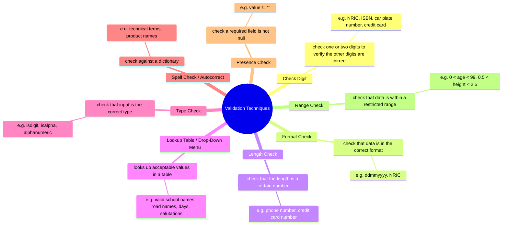

Data Verification
- Verification simply ensures that the data entered matches the original source
- prevent human error with double entry (pw changes)

Data Validation
==to check to ensure that data entered is sensible and reasonable. does not check the accuracy==

validation techniques

| Presence Check | string == ''                                    |
| -------------- | ----------------------------------------------- |
| Range Check    | 79999999 < n < 100000000                        |
| Length Check   | len(string) < 6:                                |
| Type Check     | type(eval("string")) or .isnumeric()/.isalpha() |
| Format Check   | [.find('@'):] == '@students.edu.sg':            |

a , b = b,a 
easier variable swap