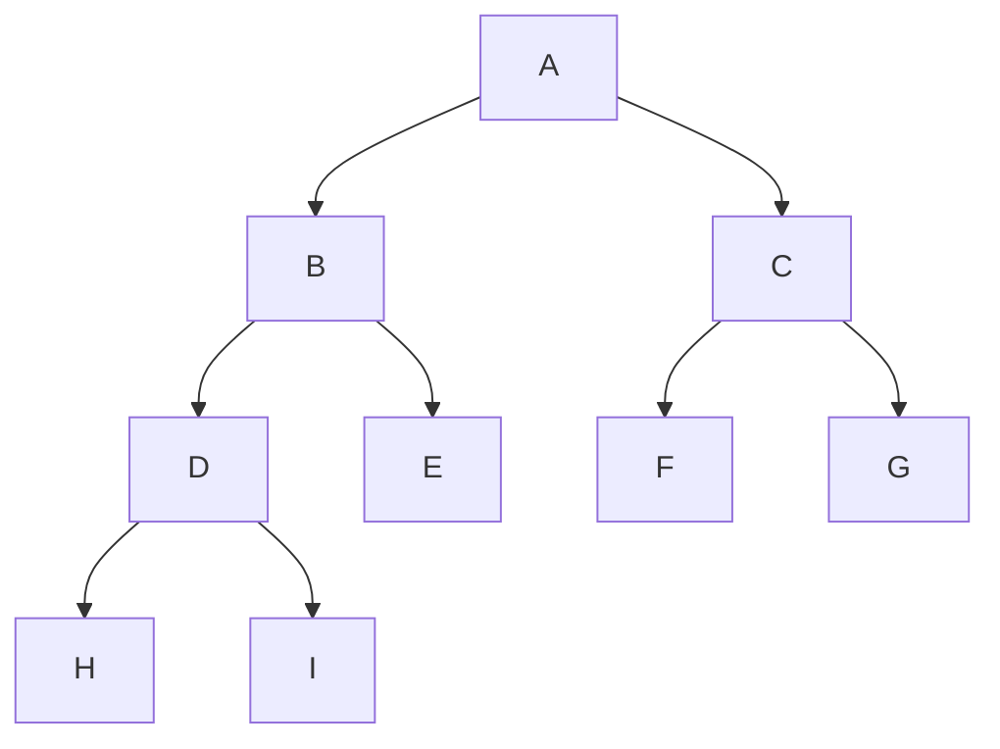
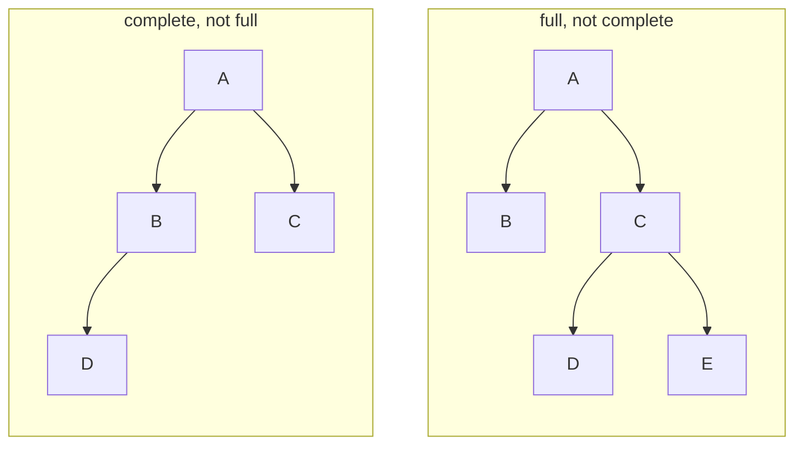
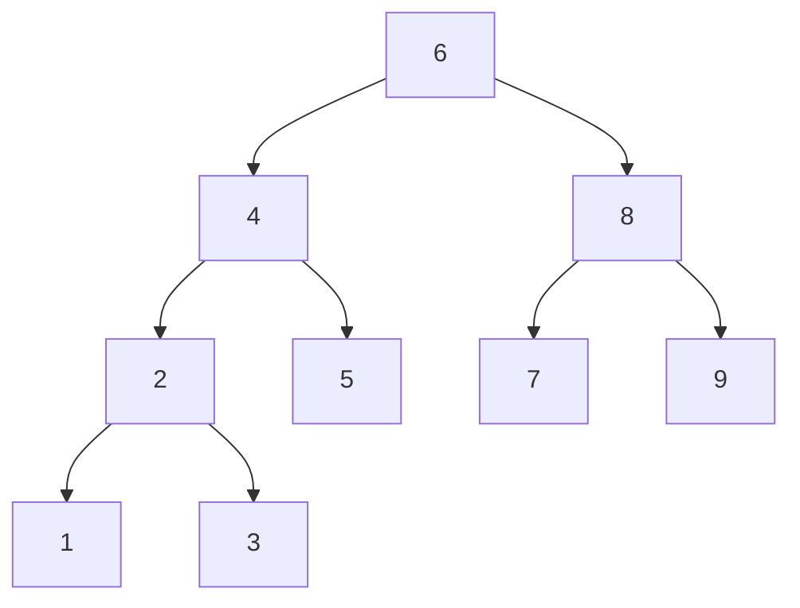
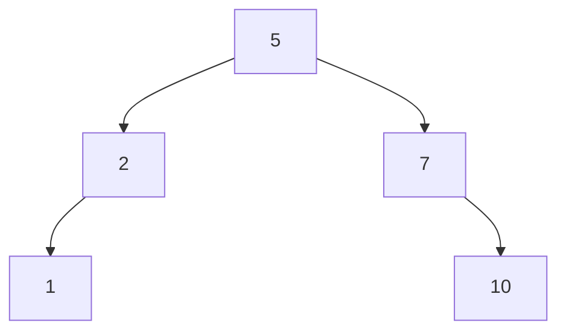
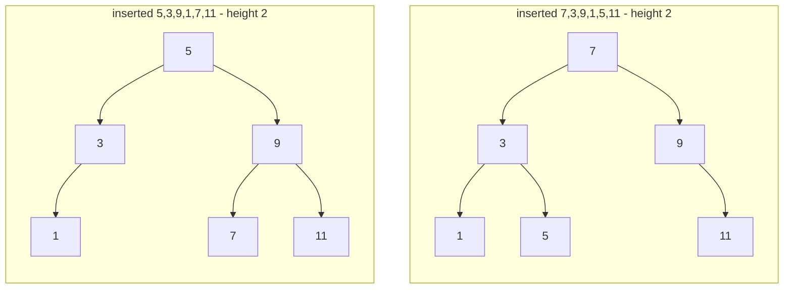
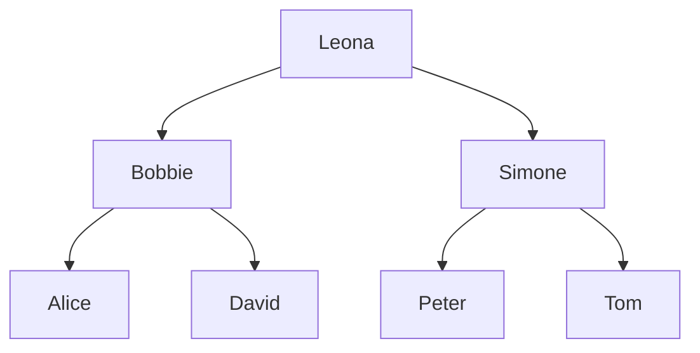
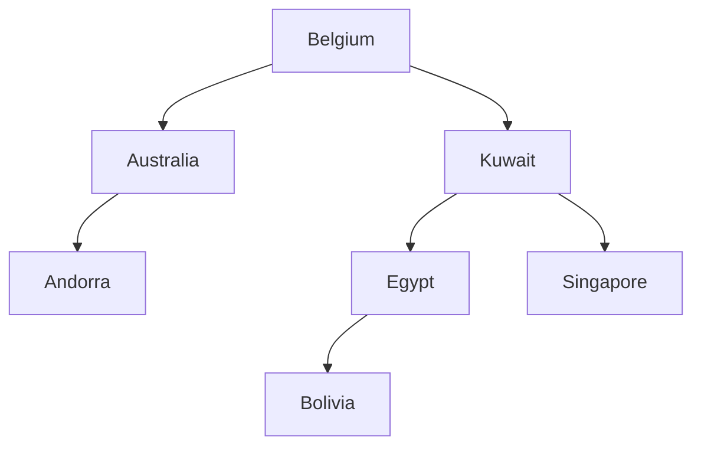

> [!summary] Quick View
> A **binary tree** is non-linear: nodes joined by edges in a hierarchy, each node with **at most two** children.
> A **binary search tree (BST)** adds ordering — everything left of a node is smaller, everything right is larger. Search is `O(log n)` **if the tree is balanced**.

> [!important] Syllabus scope — and it's examined nearly every year
> | Ref | Outcome |
> | --- | ------- |
> | 2.1.3 | create, update (edit, insert, delete) and **search** operations for binary trees (including BSTs) — *Exclude: editing and deleting nodes from binary search trees* |
> | 2.1.4 | pre-order, in-order and post-order traversals, **including the application of in-order traversal for BSTs** |
> | 2.1.5 | **breadth-first search and depth-first search** for binary trees |
>
> Asked in 2020 Q3, 2021 Q7, 2023 Q4, 2024 Q5 and specimen 2027 Paper 1 Q2.

## Vocabulary



| Term | Meaning | Above |
| ---- | ------- | ----- |
| Node | holds the data | `A`–`I` |
| Edge | the line joining two nodes | 8 of them |
| Root | the one node with no parent | `A` |
| Parent / child | `B` is `A`'s **left child**, `C` its **right child** | — |
| Siblings | children of the same parent | `H` and `I` |
| Leaf | a node with no children | `E`, `F`, `G`, `H`, `I` |
| Subtree | a node's left and right branches are **themselves binary trees** | `B`, `D`, `E`, `H`, `I` are `A`'s left subtree |
| **Height** of the tree | edges on the **longest** root → leaf path | `3` (`A→B→D→H`) |
| **Depth** of a node | edges on the path root → that node | `D` is at depth `2` |
| **Size** | number of nodes | `9` |

> [!warning]
> Height and depth are counted in **edges**, not nodes. A single-node tree has height `0`.

### Full vs Complete

| | Rule |
| --- | ---- |
| **Full** | every node except the leaves has **two** children |
| **Complete** | every level except possibly the last is completely filled, and the last level's nodes are **as far left as possible** |



The vocabulary tree at the top is both.

## Binary Search Tree

Three rules:

1. Each node stores a **distinct** key — no duplicates.
2. Every key in a node's **left** subtree is **less than** that node's key.
3. Every key in its **right** subtree is **greater than** that node's key.

The rules apply at **every** node, not just the root.



> [!important] 2024 Q5(a)(ii) — "Give **two** properties of a binary search tree" `[2]`
> Any two of: all keys in a node's left subtree are smaller than the node's key; all keys in its right subtree are larger; every node has at most two children; the keys are unique.

### In-Order Traversal Gives Sorted Order

Read the tree above **left, node, right** and you get `1 2 3 4 5 6 7 8 9`. That is 2.1.4's *"application of in-order tree traversal for binary search trees"*.

## The Binary Tree ADT

Your ADT stores a tree as a **3-element list**: `[entry, left, right]`. An empty tree is `[]`.

```python
def make_empty_tree():                return []                    # constructors
def make_tree(entry, left, right):    return [entry, left, right]
def entry(tree):                      return tree[0]               # accessors
def left_branch(tree):                return tree[1]
def right_branch(tree):               return tree[2]
def is_empty(tree):                   return (tree == [])          # predicate
```

A leaf has **both** branches empty. Build bottom-up — children first, since `make_tree` takes them as arguments:

```python
three = make_tree(3, make_empty_tree(), make_empty_tree())
four  = make_tree(4, three, make_empty_tree())        # 3 is 4's left child
```

> [!warning]
> Always build the empty branches with `make_empty_tree()`, never a bare `[]`. The `[]` is the *representation* — the whole point of an [[LT10a Data Abstraction|ADT]] is that only the constructors and accessors touch it.

> [!example]- The lecture's `five` tree
> ```python
> eight        = make_tree(8, make_empty_tree(), make_empty_tree())
> twenty_seven = make_tree(27, make_empty_tree(), make_empty_tree())
> twenty_four  = make_tree(24, make_empty_tree(), twenty_seven)
> fifteen      = make_tree(15, eight, twenty_four)
> five         = make_tree(5, four, fifteen)
> ```
>
> ```mermaid
> flowchart TD
>   f5[5] --> f4[4]
>   f5 --> f15[15]
>   f4 --> f3[3]
>   f4 ~~~ g1:::hid
>   f15 --> f8[8]
>   f15 --> f24[24]
>   f24 ~~~ g2:::hid
>   f24 --> f27[27]
>   classDef hid fill:none,stroke:none,color:transparent
> ```
>
> It is all just nested lists:
>
> ```python
> [5, [4, [3, [], []], []], [15, [8, [], []], [24, [], [27, [], []]]]]
> ```

> [!note]
> `print_tree()` needs `from LT11b_module import *`. That module exports its own `make_tree`, `entry`, `left_branch`, `right_branch`, `make_empty_tree` and `is_empty` too, so `import *` **overwrites** yours. Put the import above your definitions if you want yours to win.

## Searching a BST — `contains`

The recursion is the same shape as [[LT11a Search|binary search]]: compare, then throw away the half that cannot hold the key.

```python
def contains(x, tree):
    if is_empty(tree):
        return False            # base case - ran off the bottom
    elif x == entry(tree):
        return True             # base case - found it
    elif x < entry(tree):
        return contains(x, left_branch(tree))     # go left
    else:
        return contains(x, right_branch(tree))    # go right
```

> [!important]
> `return` the recursive call. Without it the function walks the tree and then returns `None`.

The lecture slides call this same function `is_element_of_set(x, s)` — identical code, different name.

## Inserting — `insert_tree`

A new value always ends up as a **new leaf**. Walk down as if searching; when you run off the bottom, that empty spot is where it goes.

```python
def insert_tree(x, tree):
    if is_empty(tree):
        return make_tree(x, make_empty_tree(), make_empty_tree())
    elif x < entry(tree):
        return make_tree(entry(tree), insert_tree(x, left_branch(tree)), right_branch(tree))
    elif x > entry(tree):
        return make_tree(entry(tree), left_branch(tree), insert_tree(x, right_branch(tree)))
    else:
        return tree                 # x is already here — keys stay distinct
```

> [!important] Why the fourth branch matters
> A plain `else` on the last case puts a **duplicate** in the right subtree, breaking rule 1. Inserting `3` into `[1, 2, 3, 5]`:
>
> | Version | Result |
> | ------- | ------ |
> | `elif x > entry(tree)` … `else: return tree` | `[1, 2, 3, 5]` — unchanged |
> | plain `else` | `[1, 2, 3, 3, 5]` — duplicate |

Each call rebuilds its node with **one** branch replaced, so the return value is the new tree — use it:

```python
insert_tree(5, t1)           # wrong - the new tree is thrown away
t1 = insert_tree(5, t1)      # right
```

> [!important] "Describe the steps when a value is inserted into a BST" — specimen Paper 1 Q2(b), `[5]`
> Five marks, five steps:
> 1. Start at the **root**. If the tree is empty, the new value becomes the root.
> 2. Compare the new value with the current node's value.
> 3. If it is **smaller**, follow the **left** pointer; if **larger**, follow the **right** pointer.
> 4. Repeat from step 2 until the pointer you need to follow is **null**.
> 5. Create the node there, set the parent's left/right pointer to it, and set the new node's own pointers to null.

> [!warning] Deleting is out of scope
> 2.1.3 says *"Exclude: editing and deleting nodes from binary search trees"*, and the lecture leaves `remove` as extra practice — *"this is not fully required inside of syllabus"*.

## Traversals

Visiting every node exactly once. Part 3 calls them **`flatten`** — a traversal flattens a tree into a list.



| Function | Order | Output on `t3` |
| -------- | ----- | -------------- |
| `flatten_pre` | **entry**, left, right | `[5, 2, 1, 7, 10]` |
| `flatten` (in-order) | left, **entry**, right | `[1, 2, 5, 7, 10]` |
| `flatten_post` | left, right, **entry** | `[1, 2, 10, 7, 5]` |
| `flatten_bfs` | level by level, left to right | `[5, 2, 7, 1, 10]` |

> [!tip] The name says where the entry goes
> **Pre** visits the entry *before* its subtrees, **in** *between* them, **post** *after* both. Left always precedes right.

The first three are **DFS** — down one branch fully, then backtrack. `flatten_bfs` is **BFS** — every node at depth `d` before any at depth `d + 1`.

## Writing the Traversals

The three DFS ones are one function with `[entry(tree)]` moved:

```python
def flatten(tree):
    if is_empty(tree):
        return []
    return flatten(left_branch(tree)) + [entry(tree)] + flatten(right_branch(tree))
```

Writing `L` and `R` for the two recursive calls:

| | Return line |
| --- | ----------- |
| `flatten_pre` | `[entry(tree)] + L + R` |
| `flatten` | `L + [entry(tree)] + R` |
| `flatten_post` | `L + R + [entry(tree)]` |

BFS can't recurse like that — it needs a [[LT10c Queue|queue]] to hold the nodes waiting at the next level. Part 3 gives you `queue_adt`:

```python
from queue_adt import *          # make_empty_queue, enqueue, dequeue, is_empty_queue

def flatten_bfs(tree):
    if is_empty(tree):
        return []
    result = []
    q = make_empty_queue()
    enqueue(q, tree)                              # the node, not just its value
    while not is_empty_queue(q):
        node = dequeue(q)
        result.append(entry(node))
        if not is_empty(left_branch(node)):
            enqueue(q, left_branch(node))
        if not is_empty(right_branch(node)):
            enqueue(q, right_branch(node))
    return result
```

> [!important]
> Enqueue the **node**, not `entry(node)` — you need its branches again when it comes off the queue. Guard each branch with `is_empty` or you enqueue `[]` and crash on `entry([])`.

> [!tip] BFS and DFS are the same loop
> Swap the queue for a [[LT10b Stack|stack]] and push **right before left**, and that loop outputs pre-order instead. FIFO spreads across the level; LIFO dives down the branch.

> [!example]- The video's worked tree
> ```mermaid
> flowchart TD
>   v75[75] --> v17[17]
>   v75 --> v80[80]
>   v17 --> v3[3]
>   v17 --> v62[62]
>   v3 ~~~ y1:::hid
>   v3 --> v8[8]
>   v62 --> v26[26]
>   v62 --> v73[73]
>   v80 ~~~ y2:::hid
>   v80 --> v97[97]
>   v97 --> v96[96]
>   v97 ~~~ y3:::hid
>   v96 --> v89[89]
>   v96 ~~~ y4:::hid
>   classDef hid fill:none,stroke:none,color:transparent
> ```
>
> | | |
> | --- | --- |
> | pre | `75 17 3 8 62 26 73 80 97 96 89` |
> | in | `3 8 17 26 62 73 75 80 89 96 97` |
> | post | `8 3 26 73 62 17 89 96 97 80 75` |
> | bfs | `75 17 80 3 62 97 8 26 73 96 89` |
>
> In-order comes out **ascending** — *"in order will return the list that is actually in ascending order"*.

## Efficiency

Searching, inserting: one comparison per level, so the cost is the **height**, not the size.

For a complete tree of height `h`, every level full:

```text
n = 1 + 2 + 4 + ... + 2^h = 2^(h+1) - 1      [sum of a GP]

making h the subject:   h = log2(n + 1) - 1
```

| Shape | Height | Search |
| ----- | ------ | ------ |
| Balanced | `≈ log2 n` | `O(log n)` |
| Unbalanced (one long chain) | `n - 1` | `O(n)` — no better than a [[LT7 Lists\|list]] |

### Insertion Order Decides the Shape

The same six values, inserted in different orders:



```text
inserted 1,3,5,7,9,11 - already sorted

1 -> 3 -> 5 -> 7 -> 9 -> 11      every node is a right child

height 5 - a chain
```

Sorted input is the worst case — the tree degenerates into a linked list.

> [!important] 2023 Q4(c) — "State how two BSTs can store the same data but have a different shape" `[1]`
> The shape depends on the **order the values are inserted**.

> [!example]- Rebalancing
> A tree drifts out of balance as you insert. The fix is a function that rebuilds it evenly, called from time to time — the lecture sets `balance_tree` as its Question of the Day. Not an assessed outcome.

## BST vs Binary Search

| | [[LT11a Search\|Binary search]] | Binary search tree |
| --- | ------------- | ------------------ |
| Structure | sorted array / list | tree of nodes |
| Precondition | the sequence **must be sorted first** | the ordering is built in as you insert |
| Each step | discards half the range | discards one subtree |
| Insert | shift the later elements along | attach a new leaf, nothing moves |
| Cost | `O(log n)` | `O(log n)` **if balanced** |

Other uses named in the lecture: storing the keys of a hash table so that a [[LT10d Hashing|separate chain]] can be searched in `O(log n)` instead of `O(n)`, and divide-and-conquer generally.

> [!important] Specimen Paper 1 Q2(a) — "advantage of a BST over a **linked list**" `[2]`
> A linked list can only be searched from the head, one node at a time — `O(n)`. In a BST each comparison eliminates a whole subtree, roughly halving what is left, so a value is found in `O(log n)` comparisons.

## The Array Form Used in Paper 1

**Paper 1 draws the tree as an array of nodes**, not as the Python ADT above. Each element holds a left pointer, the data and a right pointer; a separate `Root` variable holds the index of the root; `Null` (or `-1`) means "no node this way". Used in 2020, 2021 and 2024.

2021 Q7 — array `Names`, `Root = 1`:

| Index | LPtr | Data | RPtr |
| ----- | ---- | ---- | ---- |
| 0 | Null | Peter | Null |
| 1 | `3` | **Leona** | `5` |
| 2 | Null | Alice | Null |
| 3 | `2` | Bobbie | `6` |
| 4 | Null | Tom | Null |
| 5 | `0` | Simone | `4` |
| 6 | Null | David | Null |

Follow the pointers from `Root` and the tree falls out — the array order means nothing:



In-order: `Alice Bobbie David Leona Peter Simone Tom` — alphabetical, as it must be.

> [!example]- 2021 Q7(b) — insert **Eric** `[2]`
> Eric < Leona → left to index 3 (Bobbie). Eric > Bobbie → right to index 6 (David). Eric > David, and David's RPtr is Null — so that's the spot.
>
> | Change | |
> | ------ | - |
> | `Names[6].RPtr` | Null → `7` |
> | `Names[7]` | `Null`, `Eric`, `Null` |
>
> ```mermaid
> flowchart TD
>   L[Leona] --> Bo[Bobbie]
>   L --> Si[Simone]
>   Bo --> Al[Alice]
>   Bo --> Da[David]
>   Si --> Pe[Peter]
>   Si --> To[Tom]
>   Da ~~~ e1:::hid
>   Da --> Er[Eric]
>   classDef hid fill:none,stroke:none,color:transparent
> ```

> [!example]- 2020 Q3(f) — name the traversal `[1]`
> ```text
> 01 PROCEDURE P(Index: INTEGER)
> 02   IF b_tree[Index].l_ptr <> -1 THEN
> 03     P(b_tree[Index].l_ptr)
> 04   ENDIF
> 05   IF b_tree[Index].r_ptr <> -1 THEN
> 06     P(b_tree[Index].r_ptr)
> 07   ENDIF
> 08   OUTPUT b_tree[Index].data_item
> 09 ENDPROCEDURE
> ```
> Left, then right, then output → **post-order**. The `<> -1` tests on lines 02 and 05 are the **base case** — they stop the recursion at a null pointer.
>
> The rest of Q3 was recursion and the call [[LT10b Stack|stack]] — see [[LT9a Recursion]].

> [!example]- 2024 Q5(c) — **reverse** in-order `[6]`
> Defined in the paper as: follow the **right** pointer and repeat → output the node → follow the **left** pointer and repeat. Mirror of in-order, so on a BST it outputs the keys in **descending** order.

## Worked Example: Specimen Paper 1 Q2

Countries in a BST — 13 marks. The queue half is in [[LT10c Queue|Queue]].



> [!example]- Q2(c)(iii) — insert the dequeued `China` and `Oman` `[2]`
> - **China** — right of Belgium, left of Kuwait, left of Egypt, right of Bolivia → **Bolivia's right child**
> - **Oman** — right of Belgium, right of Kuwait, left of Singapore → **Singapore's left child**
>
> ```mermaid
> flowchart TD
>   Be[Belgium] --> Au[Australia]
>   Be --> Ku[Kuwait]
>   Au --> An[Andorra]
>   Au ~~~ w1:::hid
>   Ku --> Eg[Egypt]
>   Ku --> Sg[Singapore]
>   Eg --> Bo[Bolivia]
>   Eg ~~~ w2:::hid
>   Bo ~~~ w3:::hid
>   Bo --> Ch[China]
>   Sg --> Om[Oman]
>   Sg ~~~ w4:::hid
>   classDef hid fill:none,stroke:none,color:transparent
> ```

## Common Mistakes

- Comparing against the **root only** — the ordering rule holds at every node.
- Counting height in **nodes** instead of edges.
- Inserting a value into the middle. A new value is always a **new leaf**.
- Mixing up in-order and pre-order — only in-order gives a BST back sorted.
- Assuming `O(log n)`. That holds only while the tree is balanced.

## Related

- [[LT11a Search]]
- [[LT9a Recursion]]
- [[LT10a Data Abstraction]]
- [[LT10b Stack]]
- [[LT10c Queue]]
- [[LT10d Hashing]]
