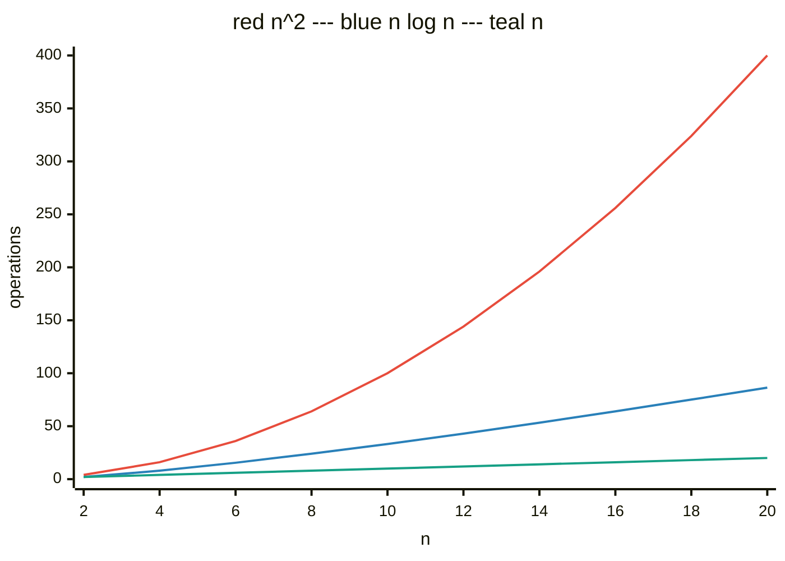

> [!summary] Quick View
> The five sorts and how to choose between them:
> [[LT12a Bubble Sort]] · [[LT12b Insertion Sort]] · [[LT12c Selection Sort]] · [[LT12d Merge Sort]] · [[LT12e Quick Sort]]

> [!important] Syllabus scope
> | Ref | Outcome |
> | --- | ------- |
> | 2.2.1 | implement **insertion, bubble, quicksort, merge** sorts |
> | 2.2.3 | compare efficiencies using Big-O, **worst case** — *Exclude: space complexity* |
>
> **Selection sort is not in 2.2.1**; the video list marks LT12c *[OPTIONAL]*.
> Asked in 2020 Q2, 2022 Q4(e), 2023 Q6, specimen 2027 P1 Q5.

## Big-O

How the work grows with `n`. Constants and smaller terms are dropped, so `n(n-1)/2` is `O(n²)`. A log's base is only a constant factor, so `O(log n)` needs no base. Where code mixes growth rates, quote only the **fastest-growing** one.

| Growth | Name | In words | Where you meet it |
| ------ | ---- | -------- | ----------------- |
| `O(1)` | constant | same time however big `n` is | reading `seq[i]` by index |
| `O(log n)` | logarithmic | each step halves what's left | [[LT11a Search\|binary search]] |
| `O(n)` | linear | double `n`, double the work | one loop over the list |
| `O(n log n)` | — | `log n` levels of halving, `n` work per level | merge sort, quicksort average |
| `O(n²)` | quadratic | double `n`, four times the work | a loop inside a loop |

| `n` | `n` | `n log n` | `n²` |
| --- | --- | --------- | ---- |
| 10 | 10 | 33 | 100 |
| 100 | 100 | 664 | 10,000 |
| 1000 | 1000 | 9,966 | **1,000,000** |

No sort here is `O(log n)`. The last cell is the bubble sort warning — *"1 million comparisons"* for `n = 1000`.

> [!important] Growth is not speed
> Big-O ignores constant overhead, so `O(n log n)` can lose on small inputs. Lecture timings, 1000 random lists each:
>
> | `n` | Bubble | Improved | Merge |
> | --- | ------ | -------- | ----- |
> | 10 | 391 ns | 322 ns | **770 ns** |
> | 100 | 28 µs | 19 µs | **8 µs** |
> | 1000 | 3 ms | 2 ms | **0.1 ms** |
> | 5000 | 77 ms | 51 ms | **0.65 ms** |

2.2.3 also covers [[LT11a Search|search]] — linear `O(n)`, binary `O(log n)`.

## In-Place and Stable

| | Meaning |
| --- | ------- |
| **In-place** | sorted items use the **same storage** — no second list built |
| **Stable** | equal elements keep their **relative order** |

> [!warning] Stability comes from the code
> *"Did the code swap even when two elements are equal?"* `>` is stable, `>=` is not.
> The output alone never shows it: `[9, 4, 3, 9, 3, 1]` sorts to `[1, 3, 3, 4, 9, 9]` either way. Track *which* `3` ended up first.

## Comparison

| Type | Sort | How it works | Best | Average | **Worst** | In-place | Stable |
| ---- | ---- | ------------ | ---- | ------- | --------- | -------- | ------ |
| Iterative | [[LT12c Selection Sort\|Selection]] | find the **smallest** in the unsorted part, swap it to the front; sorted part grows from the left | `O(n²)` | `O(n²)` | `O(n²)` | yes | no |
| | [[LT12b Insertion Sort\|Insertion]] | take the next element, shift it left until it fits the **sorted prefix** | `O(n)` | `O(n²)` | `O(n²)` | yes | yes |
| | [[LT12a Bubble Sort\|Bubble]] (optimised) | compare **adjacent** pairs, swap any out of order; the largest bubbles to the right end; stop after a pass with no swaps | `O(n)` | `O(n²)` | `O(n²)` | yes | yes |
| Recursive | [[LT12d Merge Sort\|Merge]] | halve until each piece has one element, then **merge** pairs back in order | `O(n log n)` | `O(n log n)` | `O(n log n)` | **no** | yes |
| | [[LT12e Quick Sort\|Quicksort]] | pick a **pivot**, put smaller values left and larger right, repeat on each side | `O(n log n)` | `O(n log n)` | **`O(n²)`** | yes | no |
| Gambling | Bogosort | shuffle at random until sorted | `O(n)` | `O(n·n!)` | unbounded | yes | no |

Bogosort isn't in the syllabus.

Nearly sorted → insertion or optimised bubble. Guaranteed performance → merge, the only `O(n log n)` worst case. Tight memory → anything but merge. Order of equal items matters → not selection, not quicksort.

> [!example]- 1280 books, one second per comparison
> Bubble 818,560 comparisons — **nine days**. Insertion about half — **five days**. Quicksort **under 3½ hours**.

## Exam Answers

The comparative questions. Single-algorithm ones sit in each sort's own note.

> [!important] 2020 Q2(c) — largely sorted data: insertion over quicksort `[4]`
> Insertion runs `O(n)` on nearly sorted data — each element is near its place, so the inner loop exits after a comparison or two. Quicksort with a first/last pivot hits its **worst case** `O(n²)` on that same input. Insertion also has no recursion overhead and is stable.

> [!important] 2022 Q4(e) — merge over quicksort in a fixed-capacity array `[2]`
> Merge is `O(n log n)` in every case; quicksort degrades to `O(n²)` on bad splits. A fixed array of **ordered** data is exactly quicksort's worst case.

> [!important] 2025 Promo P1 Q1(b) — insertion vs merge for large unsorted arrays `[2]`
> 1m insertion `O(n²)`, merge `O(n log n)` · 1m so **merge** suits large unsorted arrays.

## Common Mistakes

- Judging stability from the algorithm's name instead of the code.
- Giving a best case without saying which **version** of bubble sort.
- Quoting quicksort's average `O(n log n)` when 2.2.3 asks for the **worst** case.

## Related

- [[LT11a Search]]
- [[LT9a Recursion]]
- [[LT11b Binary Tree]]
- [[LT7 Lists]]
