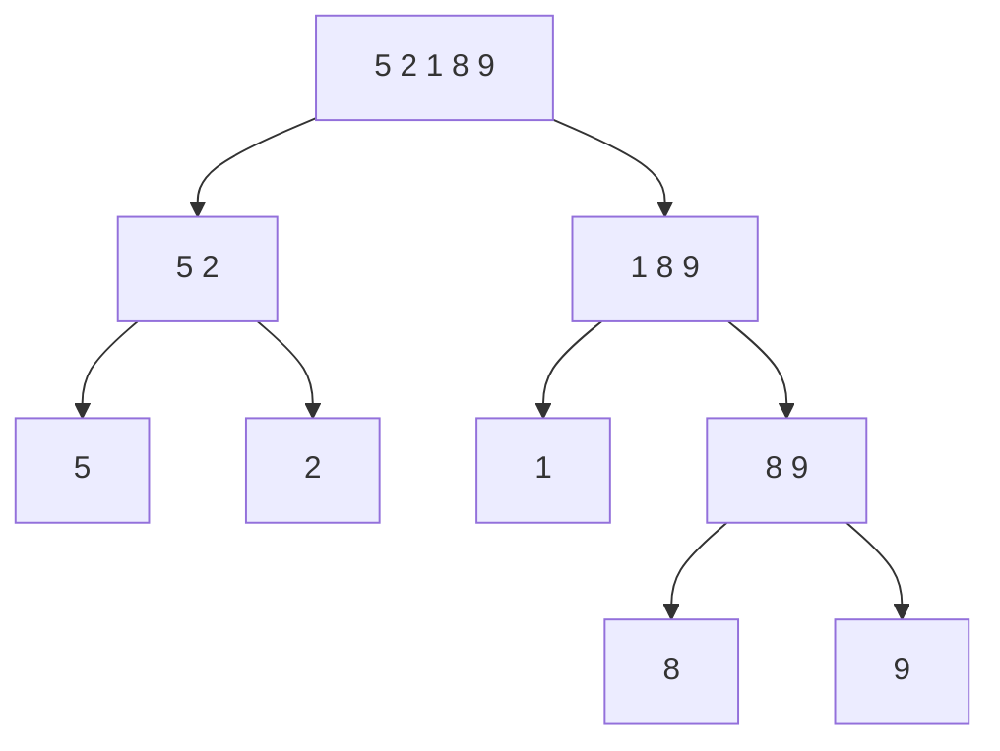

> [!summary] Quick View
> Halve until every piece holds one element, then merge pairs back in order. `O(n log n)` in **every** case, but **not in-place**.
> Syllabus 2.2.1. Scope, Big-O and the cross-sort comparison are in [[LT12 Sorting Algorithms]].



The tree *is* the recursion. `split` written on its own returns it as nested tuples:

```python
def split(seq):
    if len(seq) < 2:                               # 1 element: return it as-is
        return seq
    mid = len(seq) // 2
    return split(seq[:mid]), split(seq[mid:])
```

`split([5, 2, 1, 8, 9])` gives `(([5], [2]), ([1], ([8], [9])))` — read it against the diagram above. `merge_sort` below does the same splitting inline and merges on the way back up.

| Merge | Result |
| ----- | ------ |
| `[5]` + `[2]` | `[2, 5]` |
| `[8]` + `[9]` | `[8, 9]` |
| `[1]` + `[8, 9]` | `[1, 8, 9]` |
| `[2, 5]` + `[1, 8, 9]` | `[1, 2, 5, 8, 9]` |

```python
def merge(left, right):
    result = []
    i = j = 0
    while i < len(left) and j < len(right):
        if left[i] <= right[j]:                    # <= keeps it stable
            result.append(left[i])
            i += 1
        else:
            result.append(right[j])
            j += 1
    return result + left[i:] + right[j:]           # one side is empty

def merge_sort(seq):
    if len(seq) < 2:                               # a 1-element list is sorted
        return seq
    mid = len(seq) // 2
    return merge(merge_sort(seq[:mid]), merge_sort(seq[mid:]))
```

`merge` only ever reads the **front** of each list, so merging costs `n`, not `n²`.

| Best / average / worst | `O(n log n)` — always splits and merges the same way |
| --- | --- |
| In-place | **no** — builds new lists |
| Stable | yes |

Halving `n` to 1 takes `log n` levels, each doing `n` work, so every case is `O(n log n)`.

## Exam

> [!important] Describe merge sort
> Required keywords: **divide**, **merge**, **repeat**.
> **Divide** the list into two halves, and **repeat** on each half until every sublist holds one element. Then **merge** pairs of sublists back together, each time taking the smaller of the two front elements, until one sorted list remains.

## Common Mistakes

- Forgetting the base case, or writing `len(seq) == 1` and looping forever on an empty list.
- Treating merge sort as in-place; it builds new lists.

## Related

- [[LT12 Sorting Algorithms]]
- [[LT12e Quick Sort]]
- [[LT9a Recursion]]
