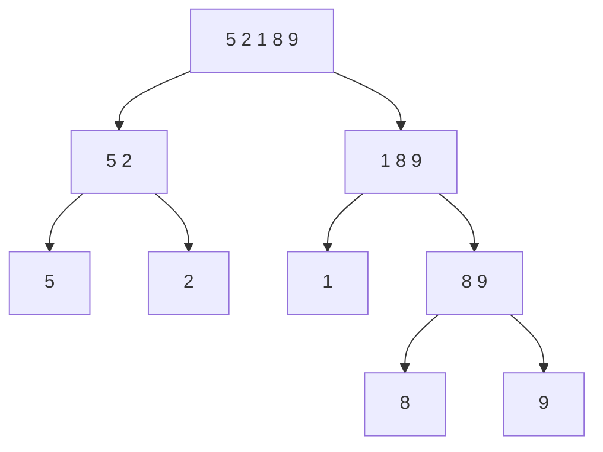

> [!summary] Quick View
> Halve until every piece holds one element, then merge pairs back in order. `O(n log n)` in **every** case, but **not in-place**.
> Syllabus 2.2.1. Scope, Big-O and the cross-sort comparison are in [[LT12 Sorting Algorithms]].



`split` returns the recursion tree as nested tuples:

```python
def split(seq):
    if len(seq) < 2:                               # 1 element: return it as-is
        return seq
    mid = len(seq) // 2
    return split(seq[:mid]), split(seq[mid:])
```

`split([5, 2, 1, 8, 9])` gives `(([5], [2]), ([1], ([8], [9])))` — read it against the diagram above. `merge_sort` below does the same splitting inline and merges on the way back up.

| Merge | Result |
| ----- | ------ |
| `[5]` + `[2]` | `[2, 5]` |
| `[8]` + `[9]` | `[8, 9]` |
| `[1]` + `[8, 9]` | `[1, 8, 9]` |
| `[2, 5]` + `[1, 8, 9]` | `[1, 2, 5, 8, 9]` |

```python
def merge(left, right):
    result = []
    i = j = 0
    while i < len(left) and j < len(right):
        if left[i] <= right[j]:                    # <= keeps it stable
            result.append(left[i])
            i += 1
        else:
            result.append(right[j])
            j += 1
    return result + left[i:] + right[j:]           # one side is empty

def merge_sort(seq):
    if len(seq) < 2:                               # a 1-element list is sorted
        return seq
    mid = len(seq) // 2
    return merge(merge_sort(seq[:mid]), merge_sort(seq[mid:]))
```

`merge` only ever reads the **front** of each list, so merging costs `n`, not `n²`.

| Best / average / worst | `O(n log n)` — always splits and merges the same way |
| --- | --- |
| In-place | **no** — builds new lists |
| Stable | yes |

Halving `n` to 1 takes `log n` levels, each doing `n` work, so every case is `O(n log n)`.

## Exam

> [!important] Describe merge sort
> Required keywords: **divide**, **merge**, **repeat**.
> **Divide** the list into two halves, and **repeat** on each half until every sublist holds one element. Then **merge** pairs of sublists back together, each time taking the smaller of the two front elements, until one sorted list remains.

> [!important] 2024 Promo P1 Q2(a) — merge sort `[5, 2, 7, 1, 3, 8, 6, 4]` with a diagram `[4+1]`
> ```text
>             [5, 2, 7, 1, 3, 8, 6, 4]
>             /                      \
>      [5, 2, 7, 1]              [3, 8, 6, 4]
>       /        \                /        \
>    [5, 2]    [7, 1]          [3, 8]    [6, 4]
>    /   \     /   \          /   \     /   \
>  [5]  [2]  [7]  [1]        [3]  [8]  [6]  [4]
>    \   /     \   /          \   /     \   /
>    [2, 5]    [1, 7]          [3, 8]    [4, 6]
>       \        /                \        /
>      [1, 2, 5, 7]              [3, 4, 6, 8]
>             \                      /
>             [1, 2, 3, 4, 5, 6, 7, 8]
> ```
>
> Words: 1m split in two recursively until single elements · 1m recombine, comparing the first elements of each sublist. Diagram: 1m halves down to single elements · 1m recombined into a sorted array.
> **(ii)** Order of growth `O(n log n)` `[1]`. 2026 Mastery P1 Q2(a) is the same question.

> [!example]- 2023 Promo P2 Task 5 — fill the merge sort pseudocode `[4+3+3]`
> ```text
> A  left  <- seq[:mid]                  B  right <- seq[mid:]
> C  left  <- MergeSort(left)            D  right <- MergeSort(right)
> E  result.append(left.pop(0))          F  result.append(right.pop(0))
> G  result += right   (left is empty)   H  result += left
> ```
>
> 1m per pair. Task 5.3 sorts `(name, timing)` tuples: 1m reuse the sort, 1m index `[1]`, 1m `float()` the timing string.

## Common Mistakes

- Forgetting the base case, or writing `len(seq) == 1` and looping forever on an empty list.
- Treating merge sort as in-place; it builds new lists.

## Related

- [[LT12 Sorting Algorithms]]
- [[LT12e Quick Sort]]
- [[LT9a Recursion]]
