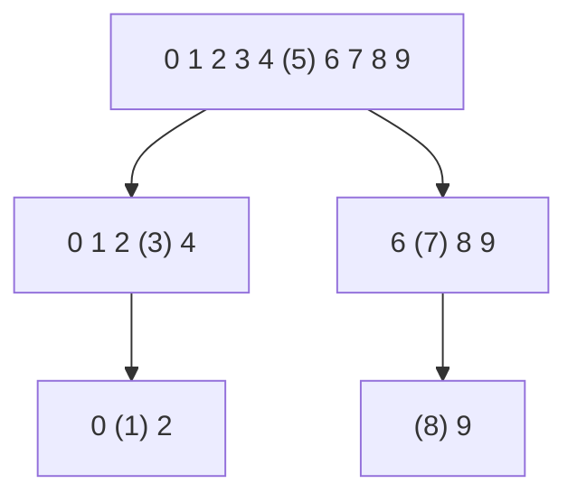

> [!summary] Quick View
> Pick a **pivot**, smaller left, larger right, recurse on each side. `O(n log n)` average but **`O(n²)` worst case**.
> Syllabus 2.2.1. Scope, Big-O and the cross-sort comparison are in [[LT12 Sorting Algorithms]].

A placed pivot is in its **final** position. Values equal to the pivot may go either side — *"it doesn't matter about the value that is equal to the pivot"*.

Cards `0`–`9`, pivot in brackets:



## Non In-Place

Pivot is the **last** element.

```python
def qsort(seq):
    if len(seq) < 2:                       # 0 or 1 element
        return seq
    pivot_value = seq[-1]
    left = []
    right = []
    for element in seq[:-1]:               # NOT seq - the pivot would duplicate
        if element < pivot_value:
            left.append(element)
        else:
            right.append(element)
    return qsort(left) + [pivot_value] + qsort(right)
```

`left` and `right` are new lists, so this one is **not in-place** — *"the primary advantage of a quicksort is because it is in-place... the one we are going through is actually non-in-place"*.

## In-Place

`low` walks right past everything **smaller** than the pivot, `high` walks left past everything **`>=`** it; when both stop, swap. Finally swap the pivot into the gap.

```text
seq  1  3  7  2  8  9  0  6  4 | 5      pivot = 5
                                          low stops at 7 (not < 5)
                                          high stops at 4 (not >= 5)
```

```python
def partition(seq, start, end):
    pivot = seq[end]
    low = start
    high = end - 1                                  # skip the pivot
    while low <= high:
        while low <= high and seq[low] < pivot:
            low += 1
        while low <= high and seq[high] >= pivot:
            high -= 1
        if low <= high:
            seq[low], seq[high] = seq[high], seq[low]
    seq[low], seq[end] = seq[end], seq[low]         # pivot into place
    return low                                      # its final index

def qsort(seq, start, end):
    if start < end:
        mid = partition(seq, start, end)
        qsort(seq, start, mid - 1)
        qsort(seq, mid + 1, end)
    return seq

def quicksort(seq):                                 # wrapper hides the indices
    return qsort(seq, 0, len(seq) - 1)
```

One call on `[1, 3, 7, 2, 8, 9, 0, 6, 4, 5]` returns `5` and gives `[1, 3, 4, 2, 0, 5, 8, 6, 7, 9]`.

> [!important]
> `low <= high` must guard **both** inner loops or the pointers run off the segment. The recursive calls use `mid - 1` and `mid + 1` — the pivot is done and must be excluded, or the recursion never shrinks.

| Best / average | `O(n log n)` |
| --- | --- |
| **Worst** | `O(n²)` — every pivot is the largest or smallest |
| In-place | yes (two-pointer), no (`left`/`right`) |
| Stable | **no** |

> [!warning] The worst case is the sorted list
> Last-element pivot on sorted data makes every partition maximally lopsided. 2.2.3 asks for **worst case**, so quicksort's answer is `O(n²)`.

## Exam

> [!important] 2023 Q6(a) — how Quicksort sorts ascending `[3]`
> Choose a pivot. Partition so all smaller values are one side, all larger the other, pivot between them in its final position. Recurse on each partition until they hold one or no elements.

> [!important] 2023 Q6(b) — worst-case time complexity `[1]`
> `O(n²)`.

> [!important] 2020 Q2(a) — the ideal pivot `[1+1]`
> **(i)** The **median** — it halves the array, so recursion is `log n` deep.
> **(ii)** Finding the median costs as much as sorting.

> [!important] 2020 Q2(b) — random pivot vs first/last `[2]`
> First/last hits the worst case `O(n²)` on already-sorted or reversed data, which is common. Random makes a lopsided split unlikely whatever the input order.

## Common Mistakes

- Giving the worst case as `O(n log n)`. It is `O(n²)`.
- Calling the `left`/`right` version in-place.
- Iterating the whole sequence in the non-in-place version — the pivot duplicates.

## Related

- [[LT12 Sorting Algorithms]]
- [[LT12d Merge Sort]]
- [[LT9a Recursion]]
