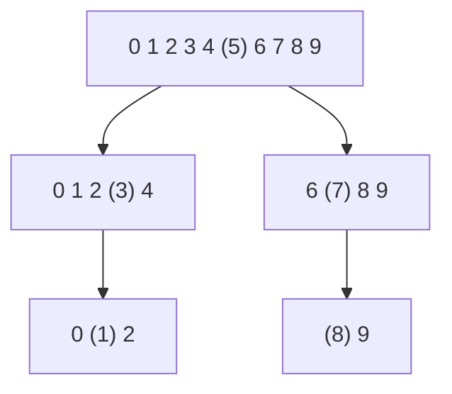

> [!summary] Quick View
> Pick a **pivot**, smaller left, larger right, recurse on each side. `O(n log n)` average but **`O(n²)` worst case**.
> Syllabus 2.2.1. Scope, Big-O and the cross-sort comparison are in [[LT12 Sorting Algorithms]].

A placed pivot is in its **final** position. Values equal to it may go either side.

Cards `0`–`9`, pivot in brackets:


```mermaid
flowchart TD
  A["0 1 2 3 4 (5) 6 7 8 9"] --> B["0 1 2 (3) 4"]
  A --> C["6 (7) 8 9"]
  B --> D["0 (1) 2"]
  C --> E["(8) 9"]
```

## Non In-Place

Pivot is the **last** element.

```python
def qsort(seq):
    if len(seq) < 2:                       # 0 or 1 element
        return seq
    pivot_value = seq[-1]
    left = []
    right = []
    for element in seq[:-1]:               # NOT seq - the pivot would duplicate
        if element < pivot_value:
            left.append(element)
        else:
            right.append(element)
    return qsort(left) + [pivot_value] + qsort(right)
```

`left` and `right` are new lists, so this version is **not in-place**.

## In-Place

`low` walks right past everything **smaller** than the pivot, `high` walks left past everything **`>=`** it. When both stop, swap. Finally swap the pivot into the gap.

```text
pivot = 5, the last element. low walks right while values are < 5,
high walks left while values are >= 5. When both stop, swap.

index   0  1  2  3  4  5  6  7  8  9
        1  3  7  2  8  9  0  6  4  5
              L                 H  P    swap 7 and 4
        1  3  4  2  8  9  0  6  7  5
                    L     H        P    swap 8 and 0
        1  3  4  2  0  9  8  6  7  5
                    H  L           P    crossed, so swap 9 with the pivot
        1  3  4  2  0  5  8  6  7  9
        \___ < 5 ___/  ^  \___ >= 5 __/
                    index 5, final spot
```

```python
def partition(seq, start, end):
    pivot = seq[end]
    low = start
    high = end - 1                                  # skip the pivot
    while low <= high:
        while low <= high and seq[low] < pivot:
            low += 1
        while low <= high and seq[high] >= pivot:
            high -= 1
        if low <= high:
            seq[low], seq[high] = seq[high], seq[low]
    seq[low], seq[end] = seq[end], seq[low]         # pivot into place
    return low                                      # its final index

def qsort(seq, start, end):
    if start < end:
        mid = partition(seq, start, end)
        qsort(seq, start, mid - 1)
        qsort(seq, mid + 1, end)
    return seq

def quicksort(seq):                                 # wrapper hides the indices
    return qsort(seq, 0, len(seq) - 1)
```

One call on `[1, 3, 7, 2, 8, 9, 0, 6, 4, 5]` returns `5` and gives `[1, 3, 4, 2, 0, 5, 8, 6, 7, 9]`.

> [!example]- Extension: pivot at the **front** instead
> Mirror every direction. `low` starts one past the pivot, `high` at the end, and the pivot swaps into `high`'s slot.
>
> ```python
> def partition(seq, start, end):
>     pivot = seq[start]
>     low, high = start + 1, end                  # low skips the pivot now
>     while low <= high:
>         while low <= high and seq[low] < pivot:
>             low += 1
>         while low <= high and seq[high] >= pivot:
>             high -= 1
>         if low <= high:
>             seq[low], seq[high] = seq[high], seq[low]
>     seq[start], seq[high] = seq[high], seq[start]
>     return high
> ```
>
> `[6, 3, 7, 2, 8, 9, 0, 1, 4, 5]` returns `6` and gives `[0, 3, 5, 2, 4, 1, 6, 9, 8, 7]`. Either pivot choice has the same worst case: sorted input.
>
> 2025 Promo P2 Task 5 gives this exact function as pseudocode, with `Hi ← Hi - 1`, the swap inside the loop, and the pivot swap blanked out.

> [!important]
> Guard **both** inner loops with `low <= high` to stay within the segment. Exclude the placed pivot using `mid - 1` and `mid + 1` so recursion shrinks.

| Best / average | `O(n log n)` |
| --- | --- |
| **Worst** | `O(n²)` (every pivot is the largest or smallest) |
| In-place | yes (two-pointer), no (`left`/`right`) |
| Stable | **no**, except the three-list version (`less`, `equal`, `greater`), which keeps equal items in order |

> [!warning] The worst case is the sorted list
> Last-element pivot on sorted data makes every partition maximally lopsided. 2.2.3 asks for **worst case**, so quicksort's answer is `O(n²)`.

## Exam

> [!important] Describe quicksort
> Required keywords: **pivot**, **partition**, **repeat**.
> Choose a **pivot**, then **partition** the list so everything smaller sits on one side and everything larger on the other, leaving the pivot in its final position. **Repeat** on each partition until they hold one or no elements.

> [!important] 2023 Q6(a): how Quicksort sorts ascending `[3]`
> Choose a pivot. Partition so all smaller values are one side, all larger the other, pivot between them in its final position. Recurse on each partition until they hold one or no elements.

> [!important] 2023 Q6(b): worst-case time complexity `[1]`
> `O(n²)`.

> [!important] 2020 Q2(a): the ideal pivot `[1+1]`
> **(i)** The **median**: it halves the array, so recursion is `log n` deep.
> **(ii)** Finding the median is expensive: the data would have to be sorted first.

> [!important] 2020 Q2(b): random pivot vs first/last `[2]`
> First/last hits the worst case `O(n²)` on already-sorted or reversed data, which is common. Random makes a lopsided split unlikely whatever the input order.

> [!important] 2023 Promo P1 Q2(c)–(f): non-in-place, first-element pivot `[1+3+2+2]`
> **(c)** The **median**: roughly equal halves, fewest recursive calls. Rejected: *average* (the mean may not be in the list), and *middle element* unless of the **sorted** array.
>
> **(d)** Fill the blanks:
>
> ```text
> PivotIndex = 0                                  A
> PivotValue = lst[PivotIndex]                    B
> FOR element in lst:                             C
>     IF element < PivotValue  THEN APPEND element TO Left
>     ELSE IF element > PivotValue THEN APPEND element TO Right
>     ELSE APPEND element TO Middle
> RETURN QUICKSORT(Left) + Middle + QUICKSORT(Right)   D
> ```
>
> `len(lst)//2` for A ignores *"first element"*. `element in range(lst)` for C lost the mark: `element` is a value, not an index.
>
> **(e)** `[542, 391, 215, 482, 304, 731, 629]` partitioned once: pivot `542` at **index 4**, giving `[391, 215, 482, 304, 542, 731, 629]`.
>
> **(f)** Advantage: `O(n log n)` against bubble sort's `O(n²)`. State **both**. Disadvantage: the non-in-place version builds new lists and needs extra memory. Bubble sort does not.
>
> Scheme error: it labels `n log n` the *worst case*. Quicksort is `O(n log n)` **average**, `O(n²)` **worst**.

> [!important] 2026 Mock Promo P2 Task 9: out-of-place quicksort on `(species, number_sighted)` `[3+5]`
> ```python
> def partition(records):
>     pivot = records[0][1]                         # 1m first record's count
>     less = []
>     equal = []
>     greater = []                                  # 1m three new lists
>     for record in records:
>         if record[1] < pivot:
>             less.append(record)
>         elif record[1] == pivot:
>             equal.append(record)
>         else:
>             greater.append(record)                # 1m every record placed
>     return less, equal, greater
>
> def quick_sort(records):
>     if len(records) <= 1:
>         return records.copy()                     # 1m a new list
>     less, equal, greater = partition(records)     # 1m
>     sorted_less = quick_sort(less)                # 1m
>     sorted_greater = quick_sort(greater)          # 1m
>     return sorted_less + equal + sorted_greater   # 1m
> ```
>
> The pivot record lands in `equal`, so looping over every record is correct here. `records` itself never changes. The sightings sort to Pangolin 3, Otter 7, Monitor Lizard 7, Kingfisher 12, Civet 12, Wild Boar 15, Hornbill 18, Macaque 24.

## Common Mistakes

- Giving the worst case as `O(n log n)`. It is `O(n²)`.
- Calling the `left`/`right` version in-place.
- Iterating the whole sequence in the two-list (`left`/`right`) version: the pivot duplicates. The three-list version with `Middle` (2023 Promo, Mock Promo) loops over everything on purpose.

## Related

- [[LT12 Sorting Algorithms]]
- [[LT12d Merge Sort]]
- [[LT9a Recursion]]
