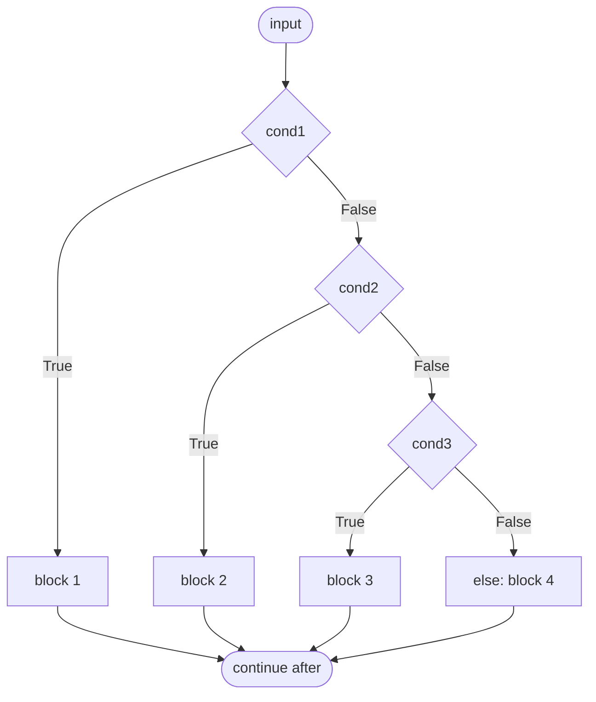

> [!summary] Quick View
> `if` / `elif` / `else` choose between paths. **At most one block runs.**

## Structure

```python
if condition:
    statement(s)
elif other_condition:
    statement(s)
else:
    statement(s)
```

- `elif` and `else` are both optional.
- `else` has no condition — it catches everything left over.

## How It Runs

> [!important] The one rule
> Conditions are tested **top to bottom**. The first one that is `True` runs its block, and every remaining condition is skipped. If none are `True`, `else` runs.




## Order Matters

Overlapping conditions must go **narrowest first**.

```python
# WRONG - a mark of 95 prints "Pass", never "Distinction"
if mark >= 50:
    print("Pass")
elif mark >= 75:
    print("Distinction")

# RIGHT - the stricter test goes first
if mark >= 75:
    print("Distinction")
elif mark >= 50:
    print("Pass")
```

## Indentation

Indentation defines the block. Use 4 spaces, consistently.

```python
if a > 0:
    print("positive")   # inside the if
print("done")           # always runs
```

## `pass`

`pass` does nothing. Use it as a placeholder when a block is required but you have no code yet.

> [!note]
> `break` and `continue` control **loops**, not conditionals — see [[LT5 Iteration|Iteration]].

## Unreachable Branches

One mistyped bound silently kills every branch below it.

```python
if 0 < volume <= 140000:            # typo - should be 14000
    return round(weight * 15)
elif 14000 < volume <= 30000:       # dead - already caught above
    return round(weight * 10)
elif 30000 < volume <= 70000:       # dead
    return round(weight * 8)
```

Every parcel now gets the highest rate. Volume `18000` should charge `weight * 10` but charges `weight * 15` — `30` becomes `45`, with no error raised.

> [!warning]
> Check each bound against the one above it. Nothing in Python warns you that a branch can never run.

## Common Mistakes

- Putting the broader condition before the narrower one.
- Using `=` instead of `==` in the condition.
- Expecting more than one branch to run — only the first match does.

> [!tip] Flowcharts
> Dropped in the **y27** syllabus (your one) — the old y26 outcomes 1.1.1–1.1.2 required them, y27 has no mention. Coursemology lists the lecture as **"[old syllabus] LT 2a - Flow Charts"**.
>
> Past papers still ask for them: 2024 Q1(a) was *"Draw a flowchart to represent the operation"* for **4 marks**. Expect to meet one while practising; don't drill drawing them for your own paper.

## Related

- [[LT1 basic python]]
- [[LT5 Iteration]]
- [[LT3a Functional Abstraction]]
