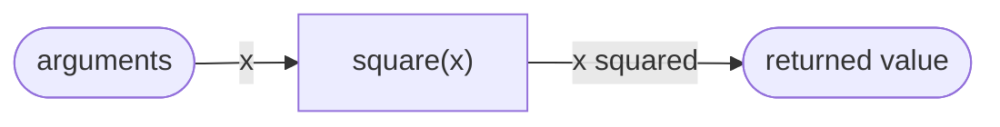

> [!summary] Quick View
> A function is a black box: you need to know **what** it does, not **how** it does it.

Writing a *good* abstraction — decomposition, naming, magic numbers — is in [[LT3b Good Abstraction|LT3b]].

## Template

```python
def name(formal_parameters):
    # body
    return value
```

| Part | Meaning |
| ---- | ------- |
| name | what the function is called |
| formal parameters | names used in the body for the values passed in |
| arguments | the actual values supplied at the call |
| body | the logic — must be indented (4 spaces) |
| `return` | sends a value back to the caller |

Type hints are optional and not enforced:

```python
def add(x: int, y: int) -> int:
    return x + y
```

## Black Box



- **Specification** — WHAT it does. You need this to call it.
- **Implementation** — HOW it does it. Hidden inside the box.

The same specification can have different implementations — both are a valid `square`:

```python
result = x * x
result = x ** 2
```

## `return` vs `print`

| | `return` | `print` |
| --- | -------- | ------- |
| Sends value back to caller | yes | no |
| Can be stored in a variable | yes | no |
| Shows on screen | no | yes |

```python
def square(x):
    print(x * x)     # displays, but returns None

square(square(2))    # TypeError - inner call gave back None
```

> [!warning]
> A function with no `return` returns `None`. `print` is for showing a human; `return` is for using the value later.

## Scope

> [!important] Local variables exist only inside the function that creates them.

1. Global scope **cannot** use local variables.
2. Local scope **can** read global variables.
3. One function's local scope cannot see another function's locals.
4. The same name can be reused in different scopes without clashing.

Reading a global name is allowed. Assigning to it creates a new local variable unless
the name is declared with `global`:

```python
rate = 0.09

def tax(amount):
    return amount * rate       # reads the global rate

count = 0

def increment():
    global count               # assignment now changes the global count
    count += 1
```

Prefer parameters and returned values where possible. They make the inputs and
outputs explicit, while a function that changes global state is harder to reuse and
test.

**Advantages of local over global variables:**

- Avoids name clashes — the same name can be reused safely elsewhere.
- Changes inside the function cannot break unrelated code.
- Makes the function self-contained, so it is easier to reuse and test.
- Local names go out of scope when the function ends. An object itself remains if
  another reference to it still exists.

## Common Mistakes

- Using `print` where `return` is needed.
- Forgetting `return`, so the function silently gives `None`.
- Trying to read a local variable from outside its function.
- Assigning to a global name inside a function without understanding that Python
  treats it as local unless `global` is used.

## Related

- [[LT3b Good Abstraction]]
- [[LT1 basic python]]
- [[LT2 Conditionals]]
- [[LT9a Recursion]]
- [[LT10a Data Abstraction]]
