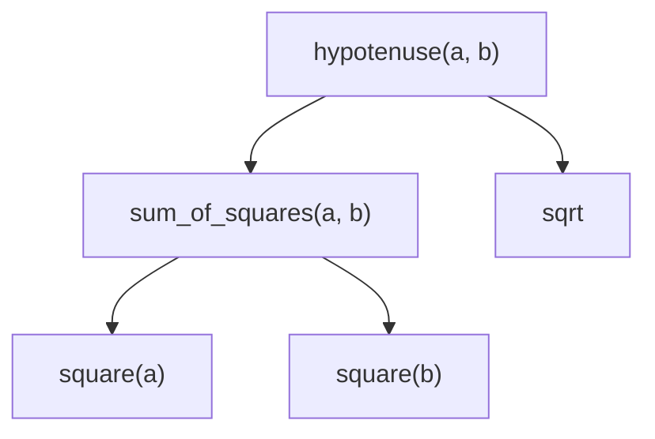

> [!summary] Quick View
> Breaking a problem into small, well-named functions. Manage complexity by dividing and conquering.

The mechanics of writing a function (parameters, `return`, scope) are in [[LT3a Functional Abstraction|LT3a]].

## What Makes an Abstraction Good

A good abstraction:

1. Makes it natural to think in tasks and subtasks
2. Makes programs easier to understand
3. Captures common patterns
4. Allows code to be reused
5. Hides implementation details
6. Separates specification from implementation
7. Makes debugging easier

> [!tip]
> A "state three advantages of using functions" question is answered from this list.

## Why It Makes Debugging Easier

```python
# dense - buried in one expression
def hypotenuse(a, b):
    return sqrt((a + a) + (b + b))


# decomposed - the bug is visibly in square()
def square(x):
    return x + x                      # should be x * x

def sum_of_squares(x, y):
    return square(x) + square(y)

def hypotenuse(a, b):
    return sqrt(sum_of_squares(a, b))
```

## Why It Allows Reuse

`square()` is written once and used by anything that needs it.

```python
PI = 3.14159

def area_of_circle(r):
    return PI * square(r)      # no need to rewrite r * r
```

## Solving Problems

**Divide and conquer**: split a problem into smaller, easier subproblems.

**Wishful thinking (top-down)**: write the solution assuming the helper functions already exist, then go back and write them.

```python
def hypotenuse(a, b):
    return sqrt(square(a) + square(b))   # pretend both exist
```



Write the top box first and assume the ones below it work. Then write those.

Same technique drives [[LT9b Recursion (Application)|recursive]] solutions.

## Avoid Magic Numbers

The lecture's taxi fare: **$3.00** for the first 1 km, **$0.22** per 400 m block or part of one up to 10 km, **$0.25** per block after that.

```text
 metres   0        1000                        10000  ->
          |---------|---------------------------|----------->
            $3.00     $0.22 per 400 m block       $0.25 per 400 m block
            flat      or part of one              or part of one

 3300 m    3.00 + 0.22 * ceil(2300/400) = 3.00 + 0.22 * 6  = 4.32
 10000 m   3.00 + 0.22 * ceil(9000/400) = 3.00 + 0.22 * 23 = 8.06
 14500 m   8.06 + 0.25 * ceil(4500/400) = 8.06 + 0.25 * 12 = 11.06
```

```python
from math import ceil

def taxi_fare(distance):                                  # metres
    if distance <= 1000:
        return 3.0
    elif distance <= 10000:
        return 3.0 + 0.22 * ceil((distance - 1000) / 400)
    else:
        return 8.06 + 0.25 * ceil((distance - 10000) / 400)
```

`ceil` because *"or less"* means a part block is charged in full. `taxi_fare(3300)` gives `4.32`, `taxi_fare(14500)` gives `11.06`.

Every literal there is a **magic number**. When fares change each one must be found and edited. Miss one and the code quietly returns the wrong fare.

`8.06` is the fare at 10 km, so compute it: call the function itself.

```python
def taxi_fare(distance):
    stage1     = 1000
    stage2     = 10000
    start_fare = 3.0
    increment1 = 0.22
    increment2 = 0.25
    block      = 400

    if distance <= stage1:
        return start_fare
    elif distance <= stage2:
        return start_fare + increment1 * ceil((distance - stage1) / block)
    else:
        return taxi_fare(stage2) + increment2 * ceil((distance - stage2) / block)
```

Raising the start fare to `$3.20`, or shrinking the block to 300 m, is now one edit.

> [!tip] The lecture's own caveat
> Naming every constant is *"yes and no"*: worth it for code that will be maintained, overkill for a function run once.

> [!important] 2023 Promo P2 Task 1: a helper function, then reuse it `[3+4]`
> `discriminant(a, b, c)` returns `b**2 - 4*a*c` if it's `>= 0`, else `None`: 1m calculation · 1m `if`/`else` and return · 1m **three test cases** (one positive, one negative, one zero).
>
> `quadratic_roots(a, b, c)` must **call `discriminant()`**, not redo the maths: 1m uses the helper · 1m `'No real root.'` when it's `None` · 1m both roots `(-b ± d ** 0.5) / (2 * a)` · 1m rounded to 1 d.p. and returned.

## Common Mistakes

- Repeating a constant in several places instead of naming it once.
- One long function that does everything, so a bug could be on any line.
- Helper functions with meaningless names like `f`, `g`, `temp`.

## Related

- [[LT3a Functional Abstraction]]
- [[LT10a Data Abstraction]]
- [[LT9b Recursion (Application)]]
- [[LT1 basic python]]
