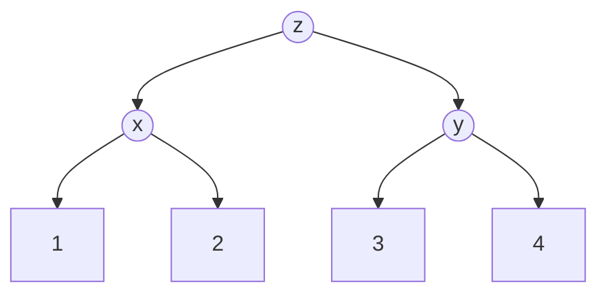

> [!summary] Quick View
> A tuple is an **ordered, immutable** collection.

## Basics

```python
tup = (1, 2, 3)
empty = ()
single = (5,)      # trailing comma is required
```

> [!warning]
> `(5)` is just the number `5` in brackets. `(5,)` is a tuple.

**Why use a tuple instead of a list?**

- The data is not meant to be modified.
- Faster to work with than a list.

## What You Cannot Do

```python
tup[2] = 'h'       # cannot update by assignment
tup.append('h')    # cannot add
tup.remove('g')    # cannot remove
del tup[6]         # cannot delete an element

del tup            # but you CAN delete the whole tuple
```

To "change" one element you rebuild the tuple around it:

```python
def change_value_at_index(tup, i, value):
    if i >= len(tup):
        return tup                              # out of range - unchanged
    return tup[:i] + (value,) + tup[i + 1:]
```

Slice up to `i`, drop in a **one-element tuple**, slice from `i + 1`. Copying works the same way — build a new tuple from the elements rather than writing `b = a`, which only makes a second name for the same object.

## Operations

```python
tup + (1, 2)   # concatenation - creates a NEW tuple
tup * 3        # repetition
"b" in tup     # membership > True / False
tup[2:5]       # slicing > a new tuple
tup[1::2]      # step - every second element from index 1
len(tup)
max(tup)
min(tup)
sorted(tup)    # returns a LIST, not a tuple
tuple("abc")   # ('a', 'b', 'c')
```

> [!important]
> `tup = tup + (4,)` does not modify the tuple — it builds a new one and points the name at it. `id(tup)` before and after shows a **different** memory address.

> [!note]
> `max` / `min` on characters compare **ASCII values**, and capitals come before lowercase — `max("aZ")` is `'a'` (97), not `'Z'` (90). See [[C2 Data representation]].

## Iteration

```python
for ele in tup:
    print(ele)

for i in range(len(tup)):
    print(tup[i])
```

## Returning Several Values

A function returns one value — make that value a tuple to hand back several.

```python
def score(tup):
    return max(tup), min(tup)     # brackets optional

high, low = score((1, 2, 3, 4, 5))
```

## Box-and-Pointer

The values are **not** stored inside the tuple. The tuple stores references to them.

```python
x = (1, 2)
y = (3, 4)
z = (x, y)
```



| Expression | Result |
| ---------- | ------ |
| `z` | `((1, 2), (3, 4))` |
| `z[0]` | `(1, 2)` |
| `z[1][1]` | `4` |

`z` holds references to the two tuple objects — not to the *names* `x` and `y`.

## Identity vs Equality

| Operator | Asks | Example |
| -------- | ---- | ------- |
| `is` | same object in memory? | identity |
| `==` | same value? | equivalence |

```python
a, b = 5, 5
x = (a, b)
y = (a, b)
z = x

x == y    # True  - same value
x is y    # False - two separate tuples
z is x    # True  - same object
```

> [!warning]
> Use `==` to compare values. `is` is unreliable for numbers: `3.000 is 3` is `False`.

## Mutable vs Immutable

```python
lst = [1, 2, 3];  lst2 = lst
lst += [4, 5, 6]
lst2              # [1, 2, 3, 4, 5, 6]  - the list was mutated

tup = (1, 2, 3);  tup2 = tup
tup += (4, 5, 6)
tup2              # (1, 2, 3)  - a new tuple was created
```

## Related

- [[LT7 Lists]]
- [[LT8 Dictionary]]
- [[LT10a Data Abstraction]]
- [[LT5 Iteration]]
