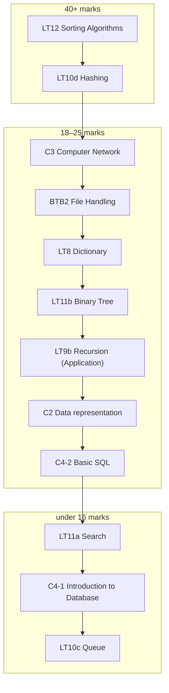

> [!summary] Quick View
> Last-minute route for the **JC1 promo**, most marks first. Ranked by what the 2023–2025 promos tested: 120 marks of P1, 180 of P2. Basics (types, conditionals, loops, input validation) left out.

| Paper | Time | Marks |
| ----- | ---- | ----- |
| P1 Written | 1 h 10 min | 40 |
| P2 Practical | 1 h 50 min | 60 |

## Route

In Obsidian the boxes are links.

## 1. Sorting — 49 marks (P1 22, P2 27)

[[LT12 Sorting Algorithms#Comparison|Comparison table]] · [[LT12e Quick Sort#Exam|Quick]] · [[LT12b Insertion Sort#Exam|Insertion]] · [[LT12d Merge Sort#Exam|Merge]] · [[LT12a Bubble Sort#Exam|Bubble]]

- **P1** — describe a sort using its keywords and trace it on the given list; merge sort wants a diagram. Give worst-case Big-O for **both** sorts when comparing.
- **P2** — fill blanks in quicksort-partition or merge pseudocode, then code it. Sorting tuples: compare `int(t[2])` or `float(t[1])`.
- Quicksort worst case is `O(n²)`; the ideal pivot is the **median**, not the average. Optimised bubble must say it **stops early**.

## 2. Hashing — 41 marks (P1 9, P2 32)

[[LT10d Hashing#Linear Probing|Linear probing]] · [[LT10d Hashing#Separate Chaining|Separate chaining]] · [[LT10d Hashing#Checksum|Checksum]]

- **P2 every year** — write the hash, build the table, search it. Marks: `[''] * size`, `% size`, store if empty, otherwise probe `(i + 1) % size` or turn the slot into a list.
- **P1** — insert a key by linear probing; deduce a possible insertion order from the finished table.
- Searching follows the **same probe path** and stops at an empty slot.

## 3. Networks — 25 marks (P1)

[[C3 Computer Network#Exam|Promo answers]] · [[C3 Computer Network#Switches and Routers|Switch vs router]]

- **Switch** joins devices in a LAN by MAC; **router** joins networks by IP.
- LAN benefits: shared printers, one internet connection, central backup and security.
- Cables: reliable, fast, secure — but costly and inflexible. Over the internet: security risk, fixed by VPN, firewall, encryption.

## 4. File to list of tuples — 25 marks (P2)

[[BTB2 File Handling#Reading Manually|Reading manually]]

- Six marks, every year: open **and close**, skip the header with `next(f)`, `strip()`, `split(',')`, make a tuple, append to a list.
- Every value comes back a **string** — `int()` or `float()` before any arithmetic.

## 5. Dictionary counting — 25 marks (P2)

[[LT8 Dictionary#Patterns|Patterns]]

- Start from `{'gold': 0, …}` or create the key on first sighting, then `d[key] += 1`.
- To transform every value, loop over the keys and assign through `d[key]`.

## 6. Binary search tree — 23 marks (P1)

[[LT11b Binary Tree#Binary Search Tree|BST rules]] · [[LT11b Binary Tree#Traversals|Traversals]]

- Insert in the **given** order; re-sorting first loses marks.
- Describe search: root → compare → left if smaller, right if larger → repeat → **empty means absent**. Most answers forget the last step.
- In-order gives ascending order. Search is `O(log n)` when balanced; `O(n log n)` was the common wrong answer.

## 7. Recursion — 20 marks (P2)

[[LT9b Recursion (Application)#The Method|The method]]

- Four marks each time: **base case**, **smaller call**, **combine**, **call and display**.
- Recurrences (`P(n) = 1.2 × P(n-1) - c`, lane `n` = lane `n-1` + 7.67) go straight into code.

## 8. Number bases — 19 marks (P1)

[[C2 Data representation#Exam|Promo answers]]

- 1 hex digit = 4 bits. Split into bytes first: MAC organisation ID = first 3 bytes, RGB = 3 bytes, bit fields by position.
- `n` bits give `2^n` values. Hex beats decimal: maps straight to binary, and easier to read.

## 9. SQL — 18 marks (P2)

[[C4-2 Basic SQL#Exam|Promo answers]]

- `SELECT … FROM … WHERE … ORDER BY`, `SUM(UnitPrice * Quantity)`, `INSERT INTO … VALUES` with every field matched.
- `DISTINCT` has been examined and isn't in the Reference Guide.

## 10. Linear and binary search — 15 marks

[[LT11a Search#Exam|Promo answers]]

- Describe binary search with **indices**: `mid = (lo + hi) // 2`, discard half, repeat.
- "Same number of steps here" doesn't make them equally efficient: `O(n)` vs `O(log n)`.

## 11. Database keys — 11 marks (P1)

[[C4-1 Introduction to Database#Exam|Promo answers]]

- Composite key: find the rows that repeat and add fields until they can't. A single `OrderID` is simpler.
- PK functions: identifies each record uniquely; records are sorted by it for searching.
- Table descriptions: PK underlined, FK dashed, **field names one word**.

## 12. Queue — 8 marks (P2)

[[LT10c Queue#Core Operations|Core operations]]

- `append` to enqueue, `pop(0)` to dequeue, **check empty first**, return `len(queue)`.

> [!warning] Not in the Paper 2 Reference Guide
> None of these is printed. **Bold** ones earned marks in the promo schemes.
>
> | Python | SQL |
> | ------ | --- |
> | **`strip()`** **`split()`** **`next()`** **`tuple()`** `sum()` `sorted()` | **`DISTINCT`** `BETWEEN` `LIKE` `IN` |
> | **`.count()`** **`.replace()`** `.find()` `.items()` `.keys()` `.values()` | `LIMIT` `GROUP BY` `HAVING` `AVG()` |
> | `try` / `except` | |
>
> Every algorithm — sorts, searches, BST, hashing, recursion — is yours to write from memory.
