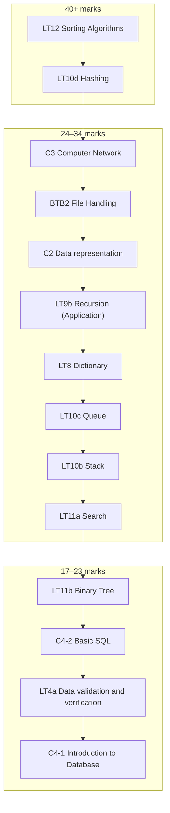

> [!summary] Quick View
> Last-minute route for the **JC1 promo**, most marks first. Ranked by what the 2023–2025 promos and your teachers' **2026 Mock Promo** tested: 160 marks of P1, 240 of P2. Basics (types, conditionals, loops) left out.

**Mon 5 Oct 2026, 1400–1715.** P2 first, a 15-minute admin break (you can't leave), then P1.

| Paper | Time | Marks | Tools |
| ----- | ---- | ----- | ----- |
| P2 Practical | 1 h 50 min | 60 | Jupyter, DB Browser, the Specimen Insert (Reference Guide) |
| P1 Theory | 1 h 10 min | 40 | written |

**Scope:** every programming topic up to QuickSort, C2 Data Representation, C3 Networking (theory), C4 Databases (C4-1 and **basic SQL only**). Any programming topic can also come up in P1.

## Route

```mermaid
flowchart TD
  subgraph t1["40+ marks"]
    s["LT12 Sorting Algorithms"] --> h["LT10d Hashing"]
  end
  subgraph t2["24–34 marks"]
    n["C3 Computer Network"] --> f["BTB2 File Handling"]
    f --> x["C2 Data representation"]
    x --> r["LT9b Recursion (Application)"]
    r --> d["LT8 Dictionary"]
    d --> qu["LT10c Queue"]
    qu --> st["LT10b Stack"]
    st --> se["LT11a Search"]
  end
  subgraph t3["17–23 marks"]
    b["LT11b Binary Tree"] --> q["C4-2 Basic SQL"]
    q --> v["LT4a Data validation and verification"]
    v --> k["C4-1 Introduction to Database"]
  end
  h --> n
  se --> b
  class s,h,n,f,x,r,d,qu,st,se,b,q,v,k internal-link
```

In Obsidian the boxes are links.

Each heading gives the total from the 2023, 2024 and 2025 promos plus the 2026 Mock. **P1** = Paper 1 theory, **P2** = Paper 2 practical. Where a number covers a whole question group, the heading says so.

## 1. Sorting: 63 marks (promos 44, Mock 19)

[[LT12 Sorting Algorithms#Comparison|Comparison table]] · [[LT12e Quick Sort#Exam|Quick]] · [[LT12d Merge Sort#Exam|Merge]] · [[LT12b Insertion Sort#Exam|Insertion]] · [[LT12a Bubble Sort#Exam|Bubble]]

- **P1**: describe a sort using its keywords and trace it on the given list. Merge sort wants a diagram. If the question says which side an odd split's extra element goes, follow it (the Mock said **left**). Give worst-case Big-O for **both** sorts when comparing.
- **P2**: fill blanks in quicksort-partition or merge pseudocode ([[BTB1 Pseudocode|pseudocode → Python]]), or write the sort on tuples: compare `t[1]` or `int(t[2])` and swap whole tuples. Descending and stable means a strict `<` (Mock Task 5). Out-of-place quicksort with `less`, `equal`, `greater` (Mock Task 9).
- Quicksort worst case is `O(n²)`. The ideal pivot is the **median**, not the average. Optimised bubble must say it **stops early**.

## 2. Hashing: 49 marks (promos 41, Mock 8)

[[LT10d Hashing#Linear Probing|Linear probing]] · [[LT10d Hashing#Separate Chaining|Separate chaining]]

- **P2 every year**: build the hash table, and write the hash function when asked (the Mock supplied `hash_locker()`). Marks: `[''] * size` (or `[None] * size`), `% size`, store if empty, otherwise probe `(i + 1) % size` or turn the slot into a list. 2023 also asked a search. The Mock probed in steps of 2: `(i + 2) % size`.
- **P1**: insert a key by linear probing. Deduce a possible insertion order from the finished table.
- Searching follows the **same probe path** and stops at an empty slot.

## 3. Networks: 34 marks (P1: promos 25, Mock 9)

[[C3 Computer Network#Exam|Exam answers]] · [[C3 Computer Network#Switches and Routers|Switch vs router]] · [[C3 Computer Network#How a Switch Works|How a switch works]] · [[C3 Computer Network#How a Router Works|How a router works]]

- **Switch** joins devices in one LAN by **MAC**, learning which port each MAC is on (SAT). **Router** joins different networks by **IP** using its routing table, and is each LAN's default gateway. Asked 2024, 2026 Mastery, and the Mock: a new device's MAC is learnt by the switch, and the router gives it an IP by **DHCP**.
- LAN in one site, WAN across sites, intranet for staff only. Client sends a **request**, server processes it and **returns** the result. A protocol is an agreed set of rules so both sides read the data the same way.
- LAN benefits: shared printers, one internet connection, central backup and security. Cables: reliable, fast, secure, but costly and inflexible. Over the internet: security risk, fixed by VPN, firewall, encryption.

## 4. File handling: 32 marks (P2 file questions: promos 25, Mock 7)

[[BTB2 File Handling#Reading Manually|Reading manually]]

- Every year: open **and close**, skip the header with `next(f)`, `strip()`, `split(',')`, append. 2023 kept lists, 2024, 2025 and the Mock wanted **tuples**. Keep every field the question lists, and drop only what it says to (the Mock dropped `Area`).
- Every value comes back a **string**: `int()` or `float()` before any arithmetic. The Mock gave a mark for it.

## 5. Number bases and characters: 27 marks (P1: promos 19, Mock 8)

[[C2 Data representation#Exam|Exam answers]]

- 1 hex digit = 4 bits. Split into bytes first: MAC organisation ID = first 3 bytes, RGB = 3 bytes, bit fields by position.
- Show working: nibbles for binary → hex, place values for hex → denary (`3D = 3 × 16 + 13 = 61`). Decode bytes with the table given. The Mock's encoding used one byte per character, so 18 characters took 18 bytes. Both ends need the same encoding.
- `n` bits give `2^n` values. Hex beats decimal: maps straight to binary, and easier to read.

## 6. Recursion: 25 marks (P2: promos 20, Mock 5)

[[LT9b Recursion (Application)#The Method|The method]]

- The **base case** always earns a mark. The rest go to the **smaller call** and **combining**, and in 2024 T5 and 2025 T3 to **calling it and displaying** the answer.
- Mock `count_character` `[5]`: 1m each for `0` when `code == ""`, comparing the first character, its `1` or `0`, the recursive call on `code[1:]`, and adding them. No loops allowed.
- Recurrences (`P(n) = 1.2 × P(n-1) - c`, lane `n` = lane `n-1` + 7.67) go straight into code.

## 7. Dictionary: 25 marks (P2 dictionary questions, promos only)

[[LT8 Dictionary#Patterns|Patterns]]

- Start from `{'gold': 0, …}` or create the key on first sighting, then `d[key] += 1`.
- To transform every value, loop over the keys and assign through `d[key]`.

## 8. Queue and stack ADTs: 24 marks (P2: queue 8 + Mock 8, stack Mock 8)

[[LT10c Queue#Core Operations|Queue]] · [[LT10b Stack#Exam|Stack, Mock answer]]

- When `module.py` gives the ADT functions (`enqueue`, `dequeue`, `is_empty_queue`, `is_empty_stack`), **use them**, not list methods. **Check empty first** and return `None`.
- Queue: `append` to enqueue, `pop(0)` to dequeue. Round robin: dequeue, take one off the count, enqueue a **new** tuple if unfinished.
- Stack: `append` to push, `pop()` to pop, `[-1]` to peek. Popping until empty gives the reverse order.

## 9. Linear and binary search: 24 marks (promos 15, Mock 9)

[[LT11a Search#Exam|Exam answers]]

- Linear trace: list every value compared, in order, then the index returned.
- Describe binary search with **indices**: `mid = (lo + hi) // 2`, discard half, repeat. In code, the Mock counted one comparison per midpoint and returned `(index, comparisons)`, or `(-1, comparisons)` if absent.
- "Same number of steps here" doesn't make them equally efficient: `O(n)` vs `O(log n)`.

## 10. Binary search tree: 23 marks (P1, promos only)

[[LT11b Binary Tree#Binary Search Tree|BST rules]] · [[LT11b Binary Tree#Traversals|Traversals]] · [[LT11b Lesson Code (List ADT)|The code]]

- Insert in the **given** order. Re-sorting first loses marks.
- Describe search: root → compare → left if smaller, right if larger → repeat → **empty means absent**. Most answers forget the last step.
- In-order gives ascending order. Search is `O(log n)` when balanced. `O(n log n)` was the common wrong answer.

## 11. SQL: 18 marks (P2, promos only)

[[C4-2 Basic SQL#Exam|Exam answers]]

- `SELECT … FROM … WHERE … ORDER BY`, `SUM(UnitPrice * Quantity)`, `INSERT INTO … VALUES` with every field matched.
- `DISTINCT` has been examined and isn't in the Reference Guide. The Mock had no SQL, but 2024 and 2025 did.

## 12. Validation: 17 marks (promos 6, Mock 11)

[[LT4a Data validation and verification|Validation]] · [[LT5 Iteration#Infinite Loops|Input loops]]

- **P1** (Mock): name the check from presence, type and format: **presence** (not empty), **type** (an integer), **format** (a pattern like `V` + three digits). A record can pass every check and still be wrong: validation doesn't test accuracy.
- **P2 Task 1**: a `while` loop that re-prompts until the input is valid, usually a **range** check.

## 13. Databases: 17 marks (P1: promos 11, Mock 6)

[[C4-1 Introduction to Database#Exam|Exam answers]]

- Composite key: find the rows that repeat and add fields until they can't. A single `OrderID` is simpler. A **candidate key** is any field, or set of fields, that could be the primary key.
- PK functions: identifies each record uniquely. Records are sorted by it for searching.
- Flat files: **redundancy** (the same data stored repeatedly) leads to **inconsistency** (copies that disagree after one is changed).
- Table descriptions: PK underlined, FK dashed, **field names one word**.

## Lowest Priority

All in scope, but none appeared in the 2023, 2024 or 2025 promo, the 2026 Mastery paper or the 2026 Mock. Revise these last.

| Topic | Note |
| ----- | ---- |
| ADT theory: constructors, accessors, `make_…` / `get_…` | [[LT10a Data Abstraction]] |
| Postfix, balanced brackets | [[LT10b Stack]] |
| Selection sort | [[LT12c Selection Sort]] |
| Checksums and check digits | [[LT10d Hashing]], [[LT4a Data validation and verification]] |
| UTF-8 | [[C2 Data representation]] |
| Topologies, TCP handshake, DNS, subnets, email protocols | [[C3 Computer Network]] |
| Random numbers | [[BTB4 Random Generator]] |
| Magic numbers | [[LT3b Good Abstraction]] |

> [!warning] Not in the Paper 2 Reference Guide
> None of these is printed. **Bold** ones earned marks in the promo schemes.
>
> | Python | SQL |
> | ------ | --- |
> | **`strip()`** **`split()`** **`next()`** **`tuple()`** `sum()` `sorted()` | **`DISTINCT`** `BETWEEN` `LIKE` `IN` |
> | **`.count()`** **`.replace()`** `.find()` `.items()` `.keys()` `.values()` | `LIMIT` `GROUP BY` `HAVING` `AVG()` |
> | `try` / `except` | |
>
> Every algorithm (sorts, searches, BST, hashing, recursion) is yours to write from memory.
