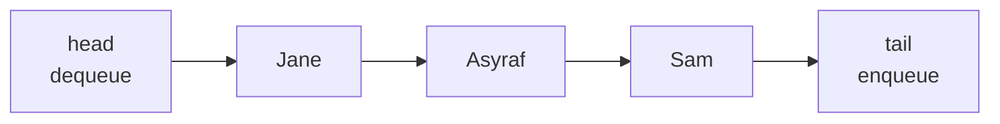

> [!summary] Quick View
> Queue = first item enqueued is the first item dequeued. This is FIFO.

## Mental Model

A queue is like a line of people.

- New items join at the tail.
- Items leave from the head.
- The oldest item leaves first.

```text
dequeue from here                      enqueue here
      head                                 tail
       |                                    |
       v                                    v
     [ Jane, Asyraf, Sam, Sally ]
```



## Operations

| Operation | Meaning | Python list version |
| --------- | ------- | ------------------- |
| `make_empty_queue()` | create an empty queue | `[]` |
| `make_queue(seq)` | create a queue from a sequence | `list(seq)` |
| `enqueue(queue, item)` | add item at tail | `queue.append(item)` |
| `dequeue(queue)` | remove and return item at head | `queue.pop(0)` |
| `front(queue)` | return head item without removing | `queue[0]` |
| `is_empty(queue)` | check if queue has no items | `queue == []` |
| `size(queue)` | number of items | `len(queue)` |
| `clear(queue)` | remove everything | `queue.clear()` |

> [!important]
> In these notes, the **head** of the queue is index `0`; the **tail** is the end of the Python list.

## Basic Implementation

```python
def make_empty_queue():
    return []

def make_queue(seq):
    return list(seq)

def is_empty(queue):
    return queue == []

def enqueue(queue, item):
    queue.append(item)

def dequeue(queue):
    if is_empty(queue):
        return None
    return queue.pop(0)

def front(queue):
    if is_empty(queue):
        return None
    return queue[0]

def size(queue):
    return len(queue)

def clear(queue):
    queue.clear()
```

## Trace Example

```python
q = make_empty_queue()
dequeue(q)       # None
enqueue(q, 5)    # [5]
enqueue(q, 3)    # [5, 3]
dequeue(q)       # 5
dequeue(q)       # 3
is_empty(q)      # True
```

State picture:

```text
enqueue 5:      [5]
enqueue 3:      [5, 3]
dequeue -> 5:   [3]
dequeue -> 3:   []
```

## Stack vs Queue

| Feature | Stack | Queue |
| ------- | ----- | ----- |
| Order | LIFO | FIFO |
| Add operation | `push()` | `enqueue()` |
| Remove operation | `pop()` | `dequeue()` |
| Inspect next item | `peek()` | `front()` |
| Remove from | top | head |
| Python list removal | `pop()` | `pop(0)` |

```text
Stack: newest item leaves first
[1, 2, 3] -> pop() -> 3

Queue: oldest item leaves first
[1, 2, 3] -> dequeue() -> 1
```

## Applications

Queues are used when order must be preserved:

- process scheduling
- network printer queue
- keyboard buffer
- customers waiting to be served
- rotating games or playlists

## Cafe Queue Example

```python
my_queue = make_empty_queue()

enqueue(my_queue, "Jane")
enqueue(my_queue, "Asyraf")
clear(my_queue)
enqueue(my_queue, "Sam")
enqueue(my_queue, "Sally")
dequeue(my_queue)
enqueue(my_queue, "Wen Jie")
enqueue(my_queue, "Penelope")
enqueue(my_queue, "Thor")
dequeue(my_queue)
enqueue(my_queue, "Loki")

print(front(my_queue))
print(size(my_queue))
```

## Printer Queue ADT

A printer queue is a queue with renamed operations.

```python
def make_print_queue():
    return make_empty_queue()

def send_job(printq, job):
    enqueue(printq, job)

def print_job(printq):
    return dequeue(printq)

def cancel_job(printq, job):
    if job in printq:
        printq.remove(job)

def clear_all(printq):
    clear(printq)

def next_job(printq):
    return front(printq)

def num_jobs(printq):
    return size(printq)

def is_pq_empty(printq):
    return is_empty(printq)
```

Example:

```python
hp_printer = make_print_queue()

send_job(hp_printer, "phys quiz.doc")
send_job(hp_printer, "maths quiz.doc")
send_job(hp_printer, "chem quiz.doc")

cancel_job(hp_printer, "maths quiz.doc")

print(print_job(hp_printer))  # phys quiz.doc
print(next_job(hp_printer))   # chem quiz.doc
```

## Printer Queue With Ink

This version stores two pieces of data:

```text
printq = [queue_of_jobs, ink_left]
```

```python
def make_print_queue():
    return [make_empty_queue(), 100]

def send_job(printq, job):
    enqueue(printq[0], job)

def print_job(printq):
    if size(printq[0]) == 0:
        return None
    if printq[1] == 0:
        print("Please replace the empty ink cartridge.")
        return False

    printed_job = dequeue(printq[0])
    printq[1] -= 1
    return printed_job

def cancel_job(printq, job):
    if job in printq[0]:
        printq[0].remove(job)

def clear_all(printq):
    clear(printq[0])

def replace_cart(printq):
    printq[1] = 100

def next_job(printq):
    return front(printq[0])

def num_jobs(printq):
    return size(printq[0])

def is_pq_empty(printq):
    return size(printq[0]) == 0
```

> [!warning]
> If the ADT is stored as `[jobs, ink_left]`, cancel from `printq[0]`, not from `printq`.

## Rotating Queue

To rotate a queue, dequeue the head and enqueue it at the tail.

```text
[A, B, C, D]
rotate once -> [B, C, D, A]
rotate twice -> [C, D, A, B]
```

Playlist example:

```python
def current_song(playlist, minutes):
    song_queue = make_queue(playlist)
    if size(song_queue) == 0:
        return None

    songs_completed = int(minutes // 4)
    rotations = songs_completed % size(song_queue)

    for i in range(rotations):
        finished_song = dequeue(song_queue)
        enqueue(song_queue, finished_song)

    return front(song_queue)
```

Pass-the-bomb example:

This follows the notebook rule: rotate `n` times, then remove the next player.

```python
def who_wins(players, n):
    queue = make_queue(players)

    while size(queue) != 1:
        for i in range(n):
            player = dequeue(queue)
            enqueue(queue, player)
        dequeue(queue)

    return front(queue)
```

## Common Mistakes

- Using `pop()` instead of `pop(0)`. `pop()` removes from the tail, which acts like a stack.
- Forgetting that `front()` should not remove the item.
- Forgetting to return `None` when dequeuing an empty queue.
- Mutating the original queue when the question expects a copy.
- Checking `job in printq` when the actual jobs are inside `printq[0]`.

## Related

- [[Data Abstraction]]
- [[Stack]]
