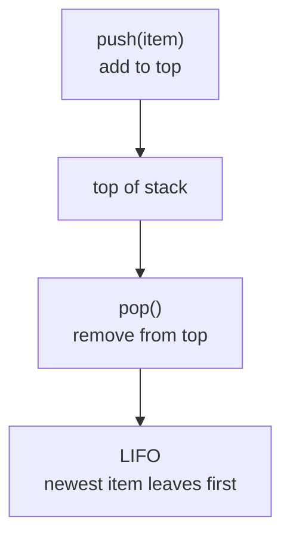
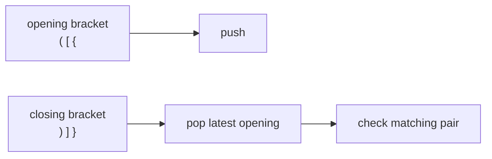

> [!summary] Quick View
> Stack = LIFO: Last In, First Out. Add/remove only from the top.

## Picture

```text
top
---
 3  <- pop removes this first
 5
 7  <- pushed first, removed last
---
bottom
```



## Operations

| Operation | What it does | List code |
| --------- | ------------ | --------- |
| `make_empty_stack()` | creates empty stack | `[]` |
| `push(stack, item)` | adds item to top | `append(item)` |
| `pop(stack)` | removes and returns top item | `pop()` |
| `peek(stack)` | returns top item only | `stack[-1]` |
| `is_empty_stack(stack)` | checks empty stack | `stack == []` |
| `clear(stack)` | removes everything | `clear()` |

> [!important]
> Top of stack = end of the Python list.

## Template

```python
def make_empty_stack():
    return []

def is_empty_stack(stack):
    return stack == []

def push(stack, item):
    stack.append(item)

def pop(stack):
    if is_empty_stack(stack):
        return None
    return stack.pop()

def peek(stack):
    if is_empty_stack(stack):
        return None
    return stack[-1]

def clear(stack):
    stack.clear()
```

## Trace

```text
start:       []
push 7:      [7]
push 5:      [7, 5]
push 3:      [7, 5, 3]
pop -> 3:    [7, 5]
pop -> 5:    [7]
peek -> 7:   [7]
```

## Pattern 1: Reverse

Push characters in, then pop them out.

```text
input:   a b c d
stack:   [a, b, c, d]
pop:     d c b a
```

```python
def reverse(string):
    stack = make_empty_stack()

    for char in string:
        push(stack, char)

    result = ""
    while not is_empty_stack(stack):
        result += pop(stack)

    return result
```

## Pattern 2: Denary to Binary

Remainders come out backwards, so use a stack to reverse them.

```text
47 / 2 -> remainder 1
23 / 2 -> remainder 1
11 / 2 -> remainder 1
5  / 2 -> remainder 1
2  / 2 -> remainder 0
1  / 2 -> remainder 1

pushed:  1 1 1 1 0 1
popped:  1 0 1 1 1 1

47 base 10 = 101111 base 2
```

```python
def denary_to_binary(n):
    if n == 0:
        return "0"

    stack = make_empty_stack()

    while n > 0:
        push(stack, n % 2)
        n = n // 2

    result = ""
    while not is_empty_stack(stack):
        result += str(pop(stack))

    return result
```

## Pattern 3: Balanced Brackets

Use a stack to remember the latest unmatched opening bracket.



```python
def is_balanced(expr):
    stack = make_empty_stack()
    pairs = {")": "(", "]": "[", "}": "{"}

    for char in expr:
        if char in "([{":
            push(stack, char)
        elif char in ")]}":
            opening = pop(stack)
            if opening != pairs[char]:
                return False

    return is_empty_stack(stack)
```

```python
print(is_balanced("([]({()}))"))  # True
print(is_balanced("(({}[)]))"))   # False
```

## Pattern 4: Postfix

Postfix puts the operator after the operands. Keep this as a stack pattern, not a whole new topic.

| Infix | Postfix |
| ----- | ------- |
| `A + B` | `A B +` |
| `3 * 4 + 5` | `3 4 * 5 +` |

Rule:

- number -> push
- operator -> pop `rhs`, pop `lhs`, calculate `lhs operator rhs`, push answer

Trace:

```text
postfix: 3 4 * 5 +

read 3:  push -> [3]
read 4:  push -> [3, 4]
read *:  pop 4, pop 3, push 12 -> [12]
read 5:  push -> [12, 5]
read +:  pop 5, pop 12, push 17 -> [17]

answer = 17
```

> [!warning]
> For `-` and `/`, order matters. Postfix `A B -` means `A - B`.

## Common Mistakes

- Stack uses `pop()`, not `pop(0)`.
- `peek()` does not remove.
- `pop()` on an empty stack should return `None`.
- If you use a stack to reverse something, do not reverse it again.

## Related

- [[Data Abstraction]]
- [[Queue]]
- [[C2 - Data representation]]
