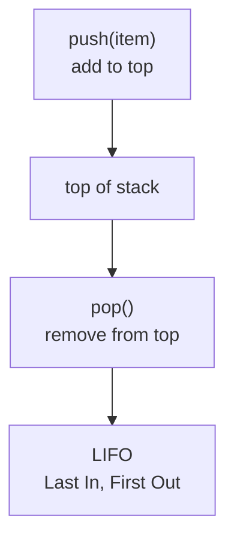

> [!summary] Quick View
> Stack = last item pushed in is the first item popped out. This is LIFO.

## Mental Model

A stack is like a stack of plates.

- Add only at the top.
- Remove only from the top.
- The newest item comes out first.
- You cannot pop from an empty stack.

```text
top
---
 3  <- last pushed, first popped
 5
 7  <- first pushed, last popped
---
bottom
```



## Operations

| Operation | Meaning | Python list version |
| --------- | ------- | ------------------- |
| `make_empty_stack()` | create an empty stack | `[]` |
| `make_stack(seq)` | create a stack from a sequence | `list(seq)` |
| `push(stack, item)` | add item to the top | `stack.append(item)` |
| `pop(stack)` | remove and return top item | `stack.pop()` |
| `peek(stack)` | return top item without removing | `stack[-1]` |
| `is_empty_stack(stack)` | check if stack has no items | `stack == []` |
| `clear(stack)` | remove everything | `stack.clear()` |

> [!important]
> In these notes, the **top** of the stack is the **end** of the Python list.

## Basic Implementation

```python
def make_empty_stack():
    return []

def make_stack(seq):
    return list(seq)

def is_empty_stack(stack):
    return stack == []

def push(stack, item):
    stack.append(item)

def pop(stack):
    if is_empty_stack(stack):
        return None
    return stack.pop()

def peek(stack):
    if is_empty_stack(stack):
        return None
    return stack[-1]

def clear(stack):
    stack.clear()
```

## Trace Example

```python
s = make_empty_stack()
pop(s)       # None
push(s, 7)   # [7]
push(s, 5)   # [7, 5]
push(s, 3)   # [7, 5, 3]
pop(s)       # 3
pop(s)       # 5
peek(s)      # 7
```

State picture:

```text
push 7:      [7]
push 5:      [7, 5]
push 3:      [7, 5, 3]
pop -> 3:    [7, 5]
pop -> 5:    [7]
peek -> 7:   [7]
```

## Reverse a Sequence

Push every character into the stack, then pop everything out.

```text
input:   a b c d
push:    [a, b, c, d]
pop out: d c b a
```

```python
def reverse(string):
    stack = make_empty_stack()

    for char in string:
        push(stack, char)

    result = ""
    while not is_empty_stack(stack):
        result += pop(stack)

    return result
```

## Denary to Binary With a Stack

Repeated division gives remainders in reverse order. A stack fixes that because popping reverses the order.

Example for `47`:

```text
47 / 2 -> remainder 1
23 / 2 -> remainder 1
11 / 2 -> remainder 1
5  / 2 -> remainder 1
2  / 2 -> remainder 0
1  / 2 -> remainder 1

remainders pushed: 1 1 1 1 0 1
pop order:         1 0 1 1 1 1

47 base 10 = 101111 base 2
```

```python
def denary_to_binary(n):
    if n == 0:
        return "0"

    stack = make_empty_stack()

    while n > 0:
        push(stack, n % 2)
        n = n // 2

    result = ""
    while not is_empty_stack(stack):
        result += str(pop(stack))

    return result
```

## Balanced Brackets

Simple counting is not enough. `([)]` has two opening and two closing brackets, but it is not balanced.

Use a stack:

1. Push opening brackets.
2. When a closing bracket appears, pop the latest opening bracket.
3. Check that the pair matches.
4. At the end, the stack must be empty.

```python
def is_balanced(expr):
    stack = make_empty_stack()
    pairs = {")": "(", "]": "[", "}": "{"}

    for char in expr:
        if char in "([{":
            push(stack, char)
        elif char in ")]}":
            opening = pop(stack)
            if opening != pairs[char]:
                return False

    return is_empty_stack(stack)
```

Checks:

```python
print(is_balanced("([]({()}))"))  # True
print(is_balanced("(({}[)]))"))   # False
```

## Infix, Prefix, Postfix

| Notation | Operator position | Example |
| -------- | ----------------- | ------- |
| infix | between operands | `A + B` |
| prefix | before operands | `+ A B` |
| postfix | after operands | `A B +` |

Postfix is useful because it can be evaluated with a stack.

## Postfix Evaluation

Rule:

- numbers get pushed
- operators pop the right operand first, then the left operand
- calculate and push the answer back

```python
def calculate_postfix(tokens):
    stack = make_empty_stack()

    for token in tokens:
        if token in ("+", "-", "*", "/"):
            rhs = pop(stack)
            lhs = pop(stack)

            if token == "+":
                push(stack, lhs + rhs)
            elif token == "-":
                push(stack, lhs - rhs)
            elif token == "*":
                push(stack, lhs * rhs)
            else:
                push(stack, lhs / rhs)
        else:
            push(stack, token)

    return pop(stack)
```

Examples:

```python
print(calculate_postfix((3, 4, "*", 5, "+")))       # 17
print(calculate_postfix((3, 4, 5, "+", "*", 2, "/")))  # 13.5
```

> [!warning]
> For `-` and `/`, operand order matters. In postfix `A B -`, calculate `A - B`, not `B - A`.

## Common Mistakes

- Using `pop(0)` for a stack. That is queue behaviour.
- Forgetting to handle empty-stack `pop()` and `peek()`.
- Mixing up `peek()` and `pop()`: `peek()` does not remove.
- Returning the stack from `push()`. Usually `push()` mutates the stack and returns nothing.
- Reversing the binary result again after the stack already reversed it.

## Related

- [[Data Abstraction]]
- [[Queue]]
- [[C2 - Data representation]]
