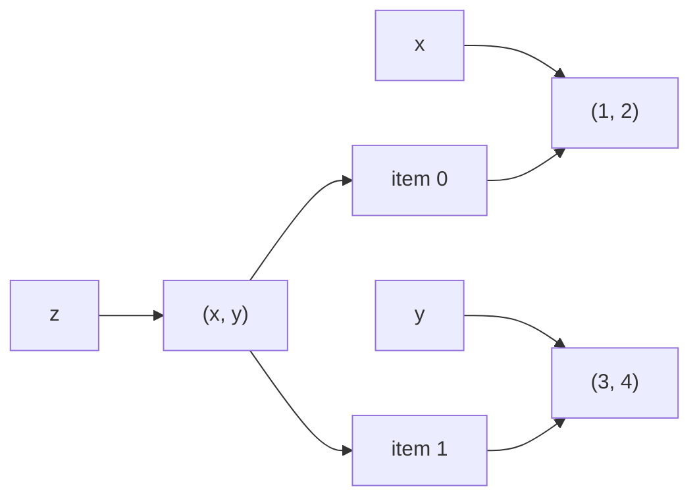

> [!summary] Quick View
> A tuple is an ordered, immutable collection.

## Basics

- Tuples are immutable, so their contents cannot be changed after creation.
- Tuples usually use round brackets: `()`
- A single-item tuple needs a trailing comma: `(a,)`

```python
tup = (1, 2, 3)
single = (5,)
```

## Box-and-Pointer View

```python
x = (1, 2)
y = (3, 4)
z = (x, y)
```



- `z` is `((1, 2), (3, 4))`
- `z[0]` is `(1, 2)`
- `z[1]` is `(3, 4)`

## Reassigning and Deleting

```python
tup = tup + (1, 2)

# a new tuple is created
```

```python
del tup
```

This deletes the whole tuple variable.

## Operations

```python
tup * 3
# repeats it three times
```

## Membership

```python
tup = ("a", "b", "c")

"b" in tup  # True
"z" in tup  # False
```

## Iteration

```python
for ele in tup:
    print(ele)
```

```python
for i in range(len(tup)):
    print(tup[i])
```

## Conversion and Useful Functions

```python
tuple("abc")  # ('a', 'b', 'c')
sorted(tup)   # returns a list
max(tup)
min(tup)
```

## Identity vs Equality

1. Identity: `is`  
   Checks whether two variables refer to the same object.
2. Equality: `==`  
   Checks whether two values are the same.

## Related

- [[Lists]]
- [[Iteration]]
